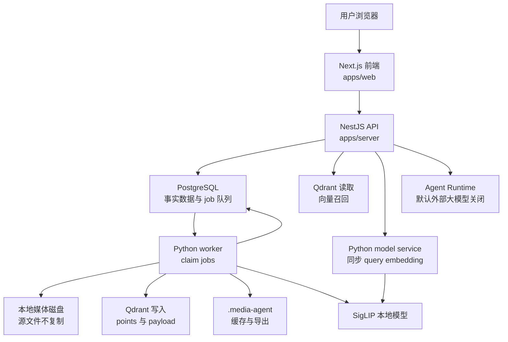
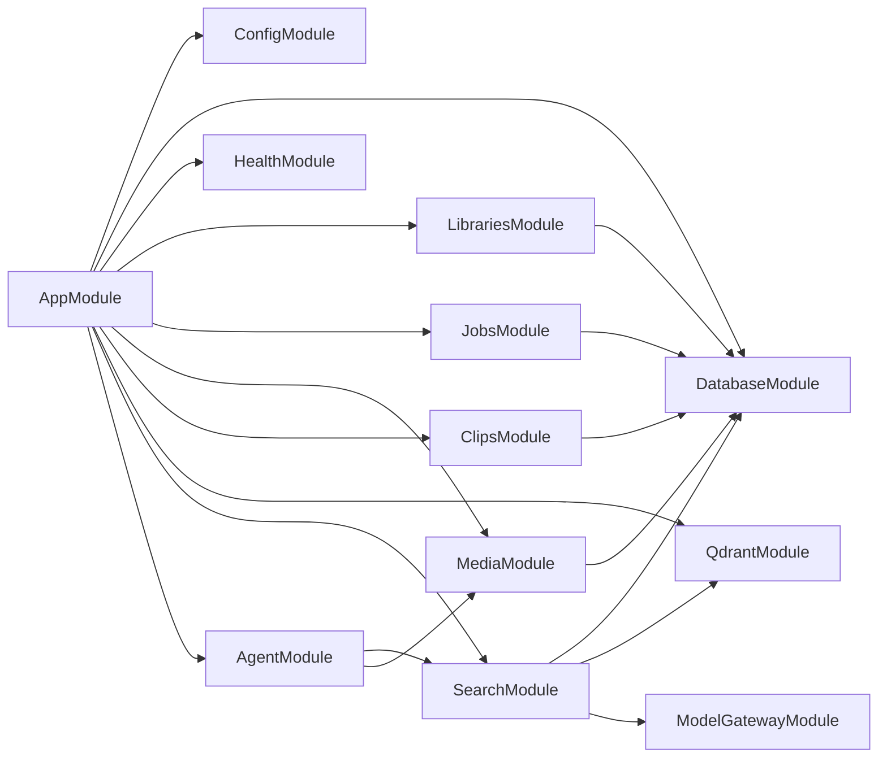

# 架构全景

## 一句话理解

这个项目是一个本地优先的媒体检索与剪辑工作台。它把用户磁盘上的原始素材保留在原处，只在本地数据库、向量库和缓存目录中保存派生信息；用户通过 Web 页面注册目录、搜索素材、查看片段、导出剪辑或发起 Agent 任务。

## 总体架构图

## 核心模块是什么，为什么需要

### `apps/web`

**是什么**：Next.js 16 / React 19 前端，包含 Library、Search、Jobs、Media Detail、Agent 等工作台页面。

**为什么需要**：这个系统的用户任务是交互式的：注册目录、看索引状态、输入搜索、确认导出、查看片段。前端不应该承担索引、搜索合并或文件处理规则，因此它通过 `apps/web/lib/api-client.ts` 访问后端，并在 `search-workspace.tsx`、`media-detail-workspace.tsx`、`agent-workspace.tsx` 中展示状态和触发命令。

### `apps/server`

**是什么**：NestJS API server，是 HTTP 入口、业务编排层、数据库 schema 拥有者、Qdrant collection 管理者、搜索合并者、Agent 运行者。

**为什么需要**：项目的主控逻辑需要稳定的模块边界和 TypeScript 类型体系。`AppModule` 组合 Config、Database、Health、Jobs、Libraries、Media、Clips、Agent、Qdrant、Search 模块；controller 接收 HTTP 请求，service 创建 job、读数据库、读 Qdrant 或调用 model service。

### `packages/shared`

**是什么**：跨前后端和跨语言协议包，包含 constants、Zod schemas、类型和生成给 Python 的 JSON Schema。

**为什么需要**：TypeScript 是 schema 权威。`packages/shared/schemas/index.ts` 定义 job input/output，`generate-json-schemas.ts` 生成 `job-schemas.json`，避免 Python worker 手写另一套协议导致漂移。

### `apps/worker-py`

**是什么**：Python 3.12 worker 和本地模型服务。worker 从 PostgreSQL `jobs` 表 claim 任务并执行 scan、probe、index、embedding、transcribe、OCR、export；model service 提供同步 `/embed/text`。

**为什么需要**：媒体处理和本地模型生态主要在 Python 与命令行工具中成熟，例如 FFmpeg、PySceneDetect、torch、transformers、faster-whisper、PaddleOCR。项目让 Python 只承担重任务，不承担产品 API 和 schema ownership。

### PostgreSQL

**是什么**：事实数据库和 job 队列，表包括 `libraries`、`media_files`、`media_assets`、`vector_refs`、`jobs`、`agent_runs`、`agent_run_events`、`agent_tool_calls`。

**为什么需要**：媒体库状态、索引状态、派生资产、任务状态和 Agent 审计都需要可恢复、可查询、可迁移。用 PostgreSQL-backed jobs 可以让 TypeScript 和 Python 共用一个事实队列，不引入 Celery 或 BullMQ 的跨语言复杂度。

### Qdrant

**是什么**：向量召回库，collection 包括 `image_vectors`、`video_frame_vectors`、`video_segment_vectors`、预留的 `audio_segment_vectors`、`text_chunk_vectors`。

**为什么需要**：视觉语义搜索需要高维向量近邻召回。Qdrant 只保存 point、vector 和轻量 payload，用户可见事实仍回 PostgreSQL 查询，避免把向量库变成第二事实源。

## NestJS 模块关系

## 数据归属边界

| 数据 | 事实源 | 说明 |
| --- | --- | --- |
| 原始媒体文件 | 用户磁盘 | 不上传、不复制，worker 直接读路径 |
| 媒体 metadata | PostgreSQL | `media_files` 保存类型、大小、mtime、duration、codec 等 |
| 派生资产 | PostgreSQL | `media_assets` 保存 image、video segment、video frame、text chunk |
| 向量引用 | PostgreSQL | `vector_refs` 保存 Qdrant point 与 asset 的关系 |
| 向量数据 | Qdrant | 只用于召回和轻量过滤 |
| transcript 与 OCR 文本 | PostgreSQL | 写入 `media_assets.text_content` |
| 任务状态 | PostgreSQL | `jobs` 表是跨语言队列 |
| Agent 审计 | PostgreSQL | `agent_*` 表保存 run、event、tool call |
| 缓存与导出 | 本地 `.media-agent` | 缩略图、帧、转写缓存、导出剪辑 |

## 运行时拓扑

端到端体验需要多个本地进程协同：

1. PostgreSQL 和 Qdrant。
2. NestJS server，默认 `:4000`。
3. Python worker，处理后台 job。
4. Python model service，默认 `:4020`，搜索时同步生成 query embedding。
5. Next.js web，默认 `:3000`。

这种拓扑的收益是职责清楚、隐私默认本地、模型重任务不阻塞 HTTP；代价是启动和排障成本更高。

## 架构判断

当前架构最强的地方是边界意识：TypeScript 拥有 schema 与产品协议，Python 执行重任务，PostgreSQL 保存事实，Qdrant 只召回，Agent 只协调且副作用要确认。它不是最简单的单进程系统，但对视频重、模型重、本地优先的目标来说，是较稳的演进形态。
