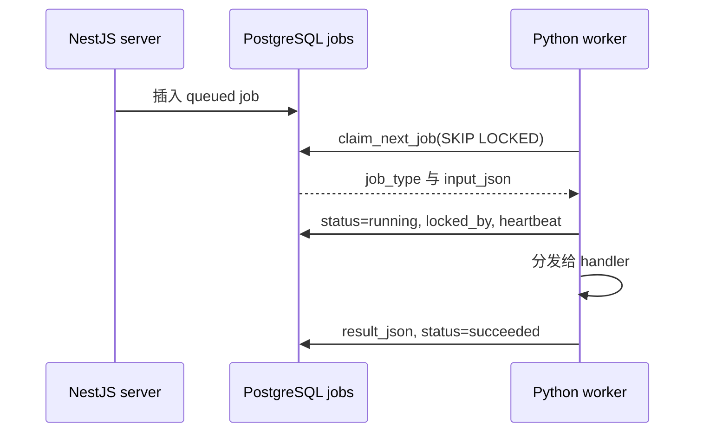
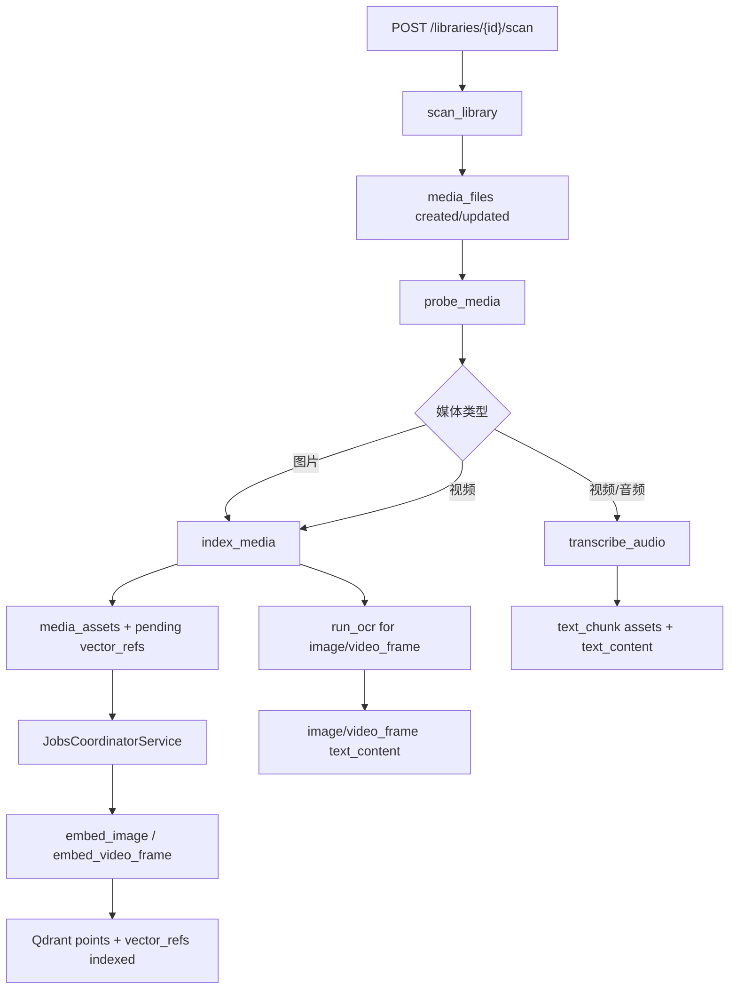
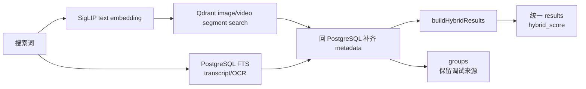

# 核心机制：任务管线、索引、检索与 Agent

## 机制一：PostgreSQL-backed job 队列

### 是什么

`jobs` 表是 TypeScript server 和 Python worker 之间的任务队列。Server 创建 job，worker 通过 `SELECT ... FOR UPDATE SKIP LOCKED` claim job，执行后写回 `succeeded` 或 `failed`。

### 为什么需要

媒体扫描、探测、抽帧、embedding、转写、OCR 和导出都可能耗时很久，不能放在 HTTP 请求内同步执行。用 PostgreSQL 当队列可以让任务状态、重试、审计和业务事实保存在同一数据库里，也避免额外引入跨语言队列系统。

### 当前实现

证据：

- `apps/server/src/database/schema.ts` 定义 `jobs` 表字段。
- `apps/server/src/database/repositories.ts` 提供 `createJob`、`claimNextJob`、`reclaimStaleJobs`。
- `apps/worker-py/media_agent_worker/repository.py` 的 `PostgresJobRepository.claim_next_job()` 使用 `FOR UPDATE SKIP LOCKED`。
- `apps/worker-py/media_agent_worker/worker.py` 根据 `job_type` 分发 handler。

## 机制二：扫描到索引的自动管线

### 是什么

用户注册 library 后创建 `scan_library` job。worker 扫描文件后自动创建 `probe_media` job；probe 后按媒体类型创建 `index_media`、`transcribe_audio`；index 后创建 pending `vector_refs` 和 OCR job；NestJS 的 `JobsCoordinatorService` 自动把 pending refs 转为 embedding jobs，显式接口保留为补漏入口。

### 为什么需要

媒体库可能很大，任何单步失败都不能拖垮全链路。拆成 job 可以让每一步幂等、可重试、可观察。

## 机制三：确定性 point id 与跨语言幂等

### 是什么

Qdrant point id 使用 UUIDv5，输入为 `asset_id|collection|model_name|model_version|vector_kind|content_hash`。

### 为什么需要

索引任务会重试，模型版本会升级，视频切片策略会变化。确定性 point id 让相同 asset 和相同模型版本重复 upsert 时不会产生重复 points；模型或 content hash 变化时会生成新 point。

证据：

- TypeScript：`apps/server/src/database/repositories.ts` 的 `deterministicPointId()`。
- Python：`apps/worker-py/media_agent_worker/indexing.py` 的 `deterministic_point_id()`。
- 两边共享 namespace `f3f4e35a-688d-4f79-99e0-91f9480a5827`。

## 机制四：同步 query embedding 与异步媒体 embedding 分离

### 是什么

搜索请求中的 query embedding 由 NestJS 同步调用本地 Python model service `/embed/text`；媒体 embedding 由 worker 的 `embed_image`、`embed_video_frame` job 异步生成并写入 Qdrant。

### 为什么需要

搜索需要低延迟，不能把用户 query 放进后台队列排队。媒体索引可以很慢，必须异步处理。两条路径分离后，搜索不会被全库索引 backlog 卡住。

证据：

- `apps/server/src/search/search-query-vector.service.ts` 说明 query embedding 不能走 PostgreSQL job queue。
- `apps/server/src/model-gateway/model-gateway.service.ts` 同步 fetch model service。
- `apps/worker-py/media_agent_worker/model_service.py` 提供 `/embed/text`。
- `apps/worker-py/media_agent_worker/embedding_worker.py` 写 Qdrant 并标记 ref indexed。

## 机制五：混合检索与合并排序

### 是什么

`SearchService` 同时查询 Qdrant 视觉向量结果和 PostgreSQL FTS 文本结果，再通过 `buildHybridResults()` 合并同 asset、相邻视频窗口、多信号来源，输出 top-level `results`。

### 为什么需要

用户搜索“红色自行车在车站附近”可能命中画面，也可能命中字幕或讲话内容。分组结果对调试有用，但用户需要一个统一排序列表。

核心规则：

- 向量来源权重 `0.55`，文本来源权重 `0.45`。
- 多信号加 `0.08` bonus。
- FTS rank 用饱和映射，不做 per-query min-max。
- 相邻视频窗口在同一文件且间隔不超过 5 秒时合并。
- `primary_reason` 根据加权贡献决定，而不是直接比较 raw score。

证据：`apps/server/src/search/search.service.ts` 和 `apps/server/src/search/search-hybrid.ts`。

## 机制六：FTS 同列复用 transcript 与 OCR

### 是什么

`transcribe_audio` 创建 `text_chunk` asset，`run_ocr` 把文字写回 image 或 video_frame asset；两者都进入 `media_assets.text_content` 和生成列 `text_tsv`。

### 为什么需要

转写和 OCR 都是“媒体资产上的文本”。复用一套 FTS 列和索引可以避免新增搜索表、减少迁移，并让 SearchService 用 asset type 区分命中原因。

证据：

- 迁移 `apps/server/drizzle/0001_phase_12_transcripts.sql` 新增 `text_content`、`text_tsv`、GIN 索引。
- `apps/worker-py/media_agent_worker/transcription.py` upsert `text_chunk`。
- `apps/worker-py/media_agent_worker/ocr.py` 写回 asset OCR 文本。
- `apps/server/src/search/search.service.ts` 中 `textSearchReason()` 映射 `transcript_match` 和 `ocr_match`。

## 机制七：Agent 只协调，副作用需确认

### 是什么

Agent 使用 Vercel AI SDK tool calling，但默认外部 LLM 关闭。只读工具可以调用搜索和媒体详情；`export_clip`、`create_index_job` 只返回 confirmation payload，用户确认后 server 才创建 job。

### 为什么需要

本地媒体库涉及隐私和文件写入。LLM 可以辅助决策，但不能未经用户确认触发剪辑导出或重建索引。

证据：

- `apps/server/src/agent/agent.service.ts` 在 `allowExternalLlm=false` 时直接记录 run 并返回提示。
- `apps/server/src/agent/agent.tools.ts` 脱敏 search 和 media detail 输出。
- `AgentService.confirmToolCall()` 只确认特定 tool，并重新用 shared schema 校验 input。

## 机制八：剪辑导出

### 是什么

前端或 Agent 确认创建 `export_clip` job，Python worker 用 FFmpeg 直接从源视频导出片段到 `.media-agent/exports/clips`。

### 为什么需要

用户的最终动作往往不是只看搜索结果，而是提取可用片段。导出放到 worker 中可避免 HTTP 阻塞，并复用 job 状态展示。

证据：`apps/server/src/clips/clips.service.ts`、`apps/worker-py/media_agent_worker/exporting.py`、`apps/web/components/media-detail-workspace.tsx`。
