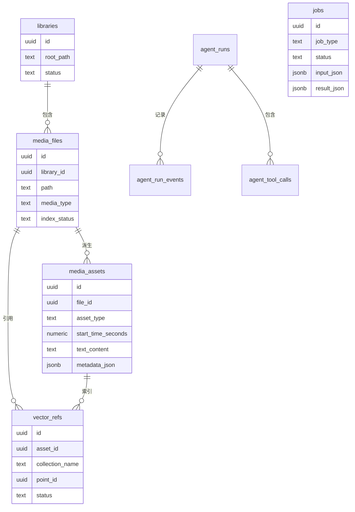
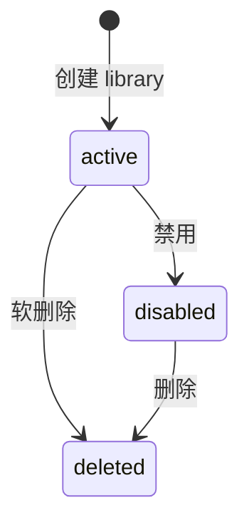
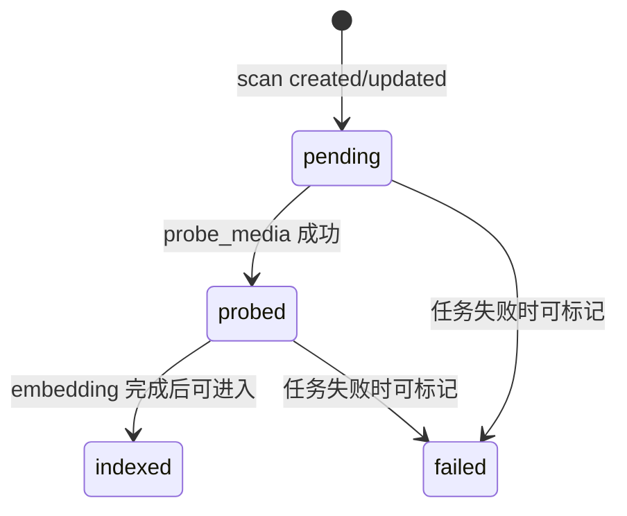
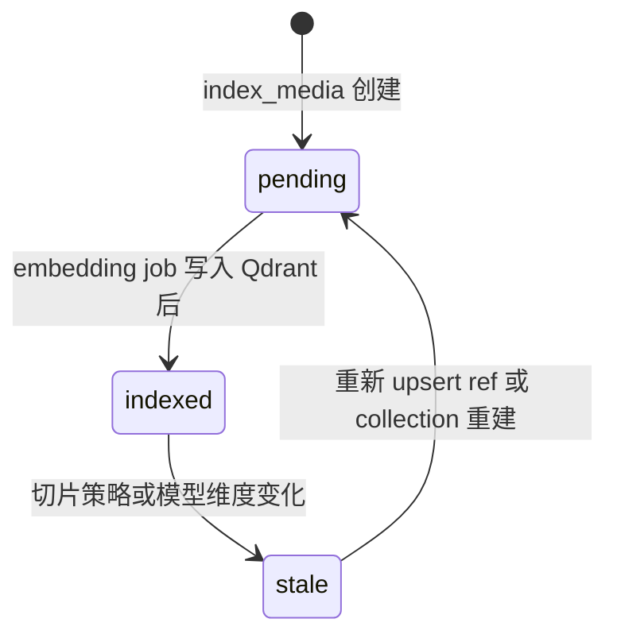
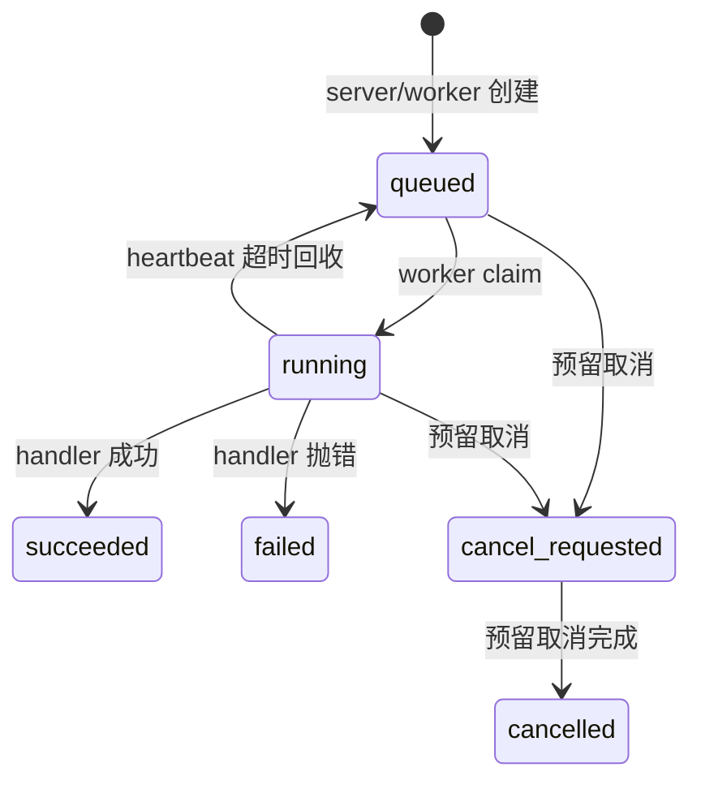
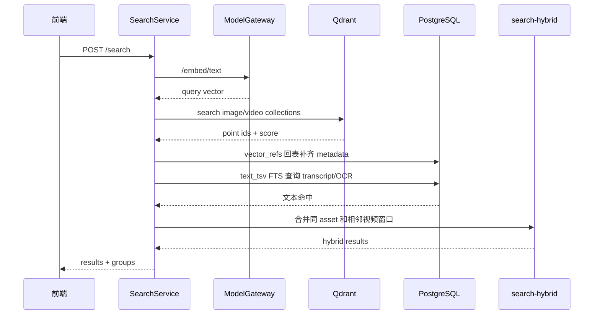
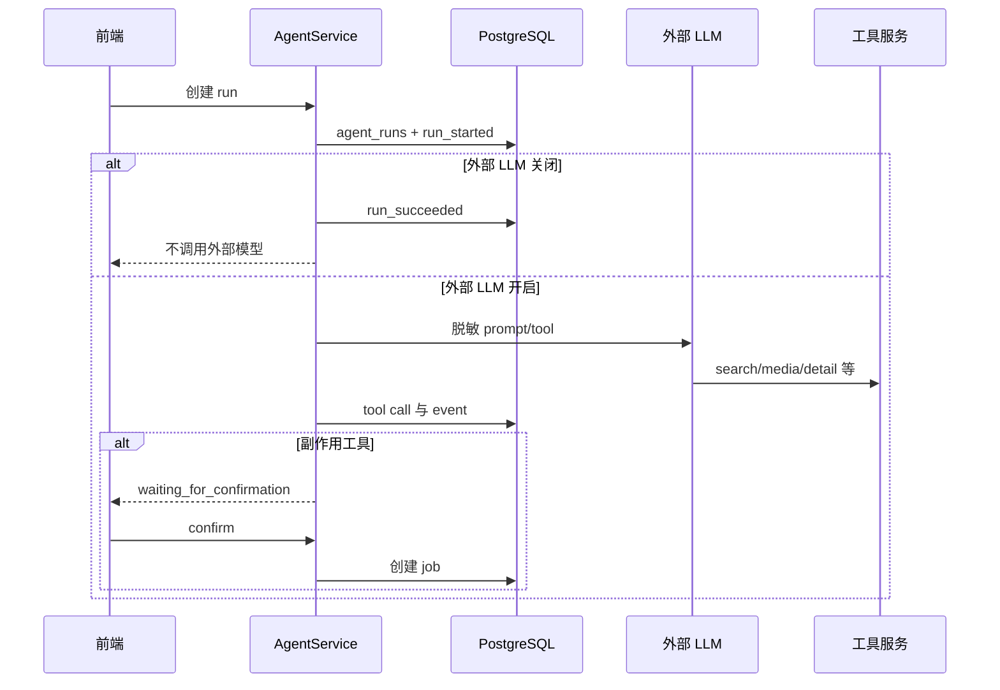

# 数据流与状态管理

## 核心数据模型

## Library 到 media file

**是什么**：Library 是用户注册的本地根目录，media file 是扫描得到的具体文件。

**为什么这样建模**：同一台机器上可能有多个媒体根目录，文件身份需要在 library 下按绝对 path 去重。`path + size + mtime` 是默认增量扫描依据，避免对 1 TB 素材做全量 hash。

状态变化：

`media_files.index_status` 当前主要流转：

源码证据：

- `apps/server/src/database/schema.ts` 的 `libraries`、`mediaFiles`。
- `apps/worker-py/media_agent_worker/repository.py` 的 `upsert_media_file()`。
- `apps/worker-py/media_agent_worker/probe.py` 的 `update_probe_metadata()` 调用。

## media asset

**是什么**：从原始文件派生出来的可检索或可操作单元，例如：

- image：整张图片。
- video_segment：视频场景或固定 30 秒片段。
- video_frame：额外关键帧。
- text_chunk：转写切出来的文本片段。

**为什么需要**：用户不是只搜索文件，还要定位文件内的时间片段、关键帧或讲话内容。asset 是“可检索单位”和“可跳转单位”。

asset 的关键字段：

- `asset_type` 决定语义。
- `start_time_seconds`、`end_time_seconds` 定位视频或音频片段。
- `frame_time_seconds` 定位视频关键帧。
- `text_content` 承载 transcript 或 OCR。
- `metadata_json` 承载 scene、OCR、transcriber、stale 等扩展信息。

## vector ref 与 Qdrant point

**是什么**：`vector_refs` 是 PostgreSQL 中的 Qdrant point 引用。它连接 asset、file、library、collection、point id、模型版本、向量维度和状态。

**为什么需要**：Qdrant 的 payload 可能不同步，也不应保存完整事实。回表需要稳定桥梁；模型升级或 collection 重建也需要知道哪些 ref 要重建。

状态变化：

源码证据：

- `apps/worker-py/media_agent_worker/indexing.py` 创建 pending refs。
- `apps/worker-py/media_agent_worker/embedding_worker.py` 写 Qdrant 后调用 `mark_vector_ref_indexed()`。
- `apps/server/src/qdrant/qdrant-collections.service.ts` collection 维度变化时回调 reset refs。

## jobs

**是什么**：跨语言任务状态机。

**为什么需要**：让扫描、探测、索引、转写、OCR、导出都有统一状态和可观察性。

当前源码中完整落地的是 queued、running、succeeded、failed 和 stale 回收；取消状态在 constants 和协议中存在，但 worker 对长任务取消检查还不是主路径。

## 搜索数据流

## Agent 数据流

## 状态管理评价

当前系统的状态设计有两个优点：

1. 大多数长期状态都在 PostgreSQL，可恢复、可测试、可迁移。
2. Qdrant 和本地缓存被明确降级为可重建派生状态。

主要代价是状态分布较广：一次搜索结果可能牵涉 `media_assets`、`vector_refs`、Qdrant point、FTS 生成列、model service 和 worker job。维护者需要先掌握“事实源在哪里”，否则容易把 payload 或缓存误认为权威。
