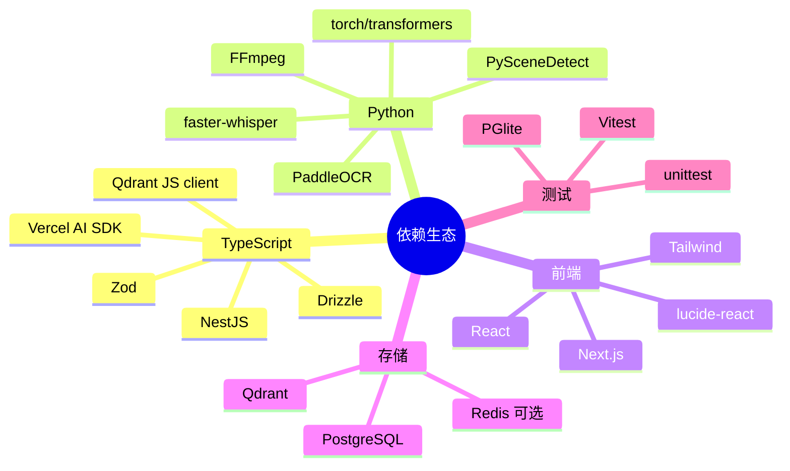

# 依赖与生态

## 总览

项目依赖选择围绕一个目标：本地优先、多模态、可分阶段演进。TypeScript 负责 Web、API、schema 和 Agent；Python 负责媒体处理和模型推理；PostgreSQL 和 Qdrant 分别承载事实与召回。

## Node 与包管理

**是什么**：Node 22、pnpm 10、monorepo workspace。

**为什么需要**：前端、后端和 shared 包都在 TypeScript 生态里；workspace 能让 shared schema 被 server 和 web 同时引用。`package.json` 和 `.nvmrc` 约束 Node 版本，降低 Next.js / NestJS / TypeScript 的运行差异。

## NestJS

**是什么**：后端 API 框架，使用默认 Express adapter。

**为什么需要**：项目模块很多，且后续会继续加能力。NestJS 的 Module、Controller、Service、provider 注入让边界更稳定。`docs/tasks/lessons.md` 记录了从 Fastify 转到 NestJS 的原因：当前用户量级下可维护性优先于极致 HTTP 性能。

## Drizzle 与 PostgreSQL

**是什么**：Drizzle 维护 TypeScript schema 和 migrations，PostgreSQL 保存事实数据和 job 队列。

**为什么需要**：媒体库状态、派生资产、任务状态和 Agent 审计需要强一致事实源。Drizzle 让 TypeScript 侧拥有 schema，PGlite 测试则让 server 单测不依赖真实 PostgreSQL。

## Zod 与 JSON Schema

**是什么**：Zod 定义 job input/output schema，`zod-to-json-schema` 生成 Python worker 可读 JSON Schema。

**为什么需要**：跨语言系统最怕协议漂移。Zod 作为 TypeScript 事实源，Python 读取生成物，避免 Python 维护独立模型。

## Qdrant

**是什么**：向量数据库，存 image、video frame、video segment 等向量 collection。

**为什么需要**：视觉语义检索需要近邻搜索。Qdrant 不承担 metadata 事实源，只保存向量和轻量 payload。`qdrant-collections.service.ts` 会按 registry 初始化 collections 和 payload indexes。

## Next.js、React、Tailwind

**是什么**：前端工具型工作台。

**为什么需要**：Next.js 提供页面结构和构建，React 提供交互组件，Tailwind 负责样式。当前前端重点不是营销页，而是 Search、Library、Jobs、Media Detail、Agent 等工作流。

## Vercel AI SDK 与 Anthropic provider

**是什么**：Agent Runtime 的 LLM tool calling 依赖。

**为什么需要**：AI SDK 的 tool schema 能用 Zod，和 shared schema 一致；它只负责模型调用和工具循环，不接管存储、向量或部署。默认外部 LLM 关闭，只有配置开启时才调用。

## FFmpeg 与 ffprobe

**是什么**：媒体探测、抽帧、音频抽取和剪辑导出工具。

**为什么需要**：视频、音频处理不应由 Node 进程手写。ffprobe 生成 duration、codec、stream 等 metadata；FFmpeg 抽代表帧、抽音频、导出 clip。

## PySceneDetect

**是什么**：视频场景边界检测工具。

**为什么需要**：固定 30 秒切片对视频语义不友好。Scene detection 让 `video_segment` 更接近自然镜头。实现中检测失败会 fallback 到固定切片，避免索引失败。

## SigLIP、torch、transformers、Pillow

**是什么**：本地视觉文本双塔 embedding 模型栈。

**为什么需要**：默认外部 LLM 关闭，搜索 query 和媒体图像需要本地模型 embedding。SigLIP 同时提供 text 和 image features，可用于文本搜图和文本搜视频代表帧。

## faster-whisper

**是什么**：本地语音转写模型。

**为什么需要**：视频和音频里的讲话内容不能靠视觉向量搜索。转写后写成 `text_chunk`，通过 PostgreSQL FTS 搜索。

## PaddleOCR

**是什么**：本地 OCR 引擎。

**为什么需要**：图片和视频关键帧中的屏幕文字、字幕、海报文字都需要被搜索。OCR 写回原 image/video_frame asset，复用 FTS。

## 测试依赖

| 层 | 工具 | 用途 |
| --- | --- | --- |
| server | Vitest | service/controller/纯函数测试 |
| server | PGlite | 无真实 PostgreSQL 的 repository/search/job 测试 |
| worker | unittest | Python handler 和 repository doubles |
| web | Vitest + Testing Library + jsdom | workspace 组件和 API client 测试 |
| shared | Vitest | job schema 测试 |

## 依赖边界判断

依赖选择整体比较克制：没有引入全栈 AI agent 框架，没有让 Redis 成为核心队列，没有让 Python 拥有 ORM，也没有在前端复制复杂业务规则。主要风险来自 Python 模型依赖重、安装和首次下载成本高，以及 TypeScript/Python 中模型 collection 配置需要手工对齐。
