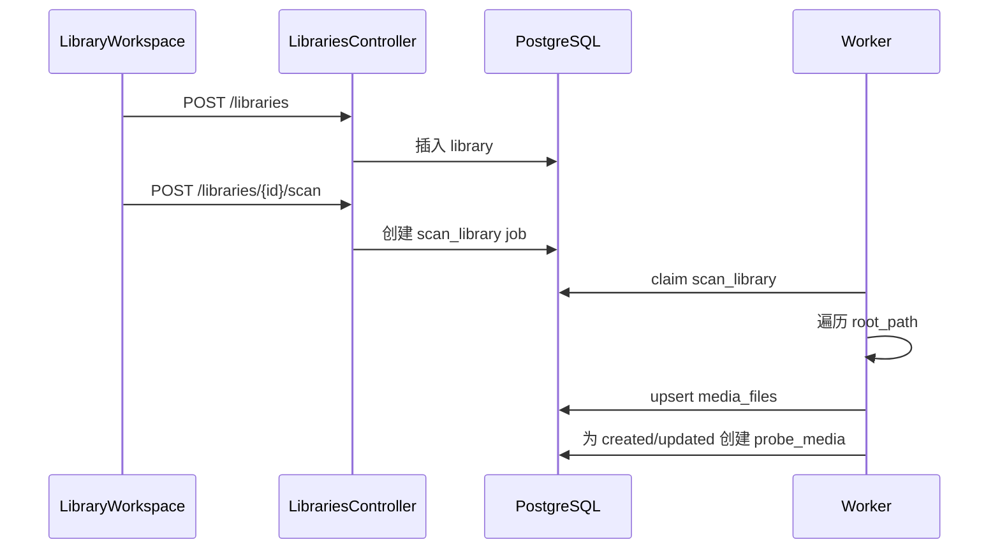
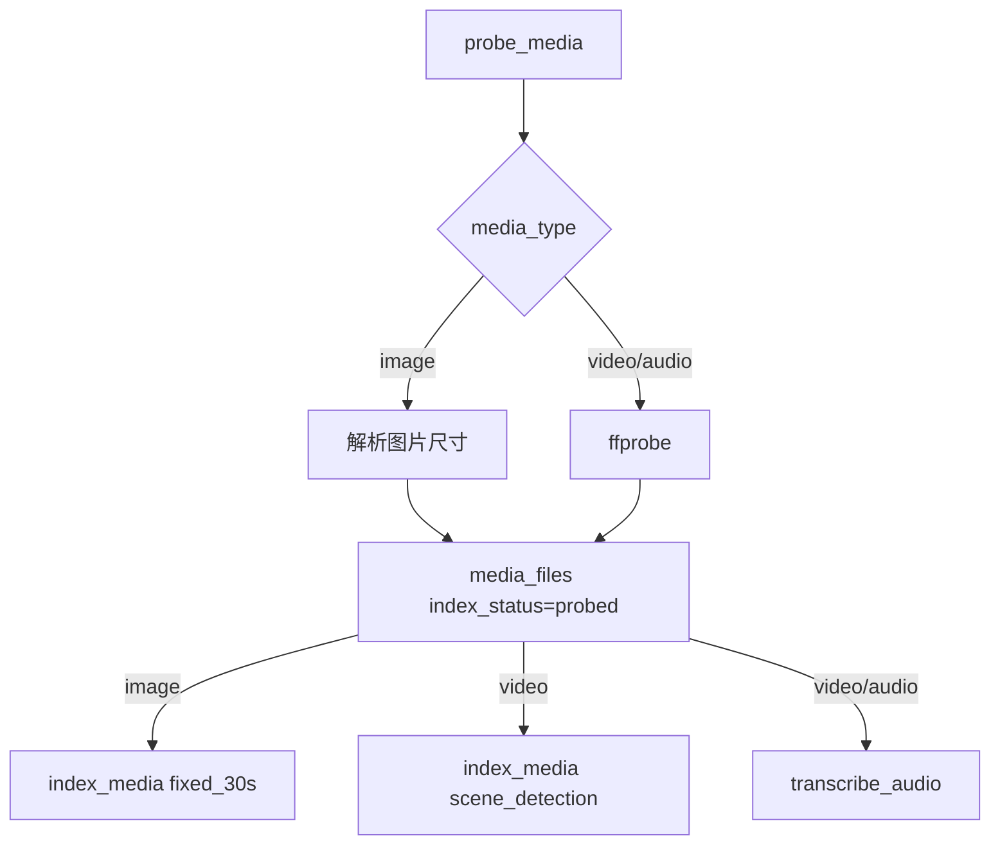
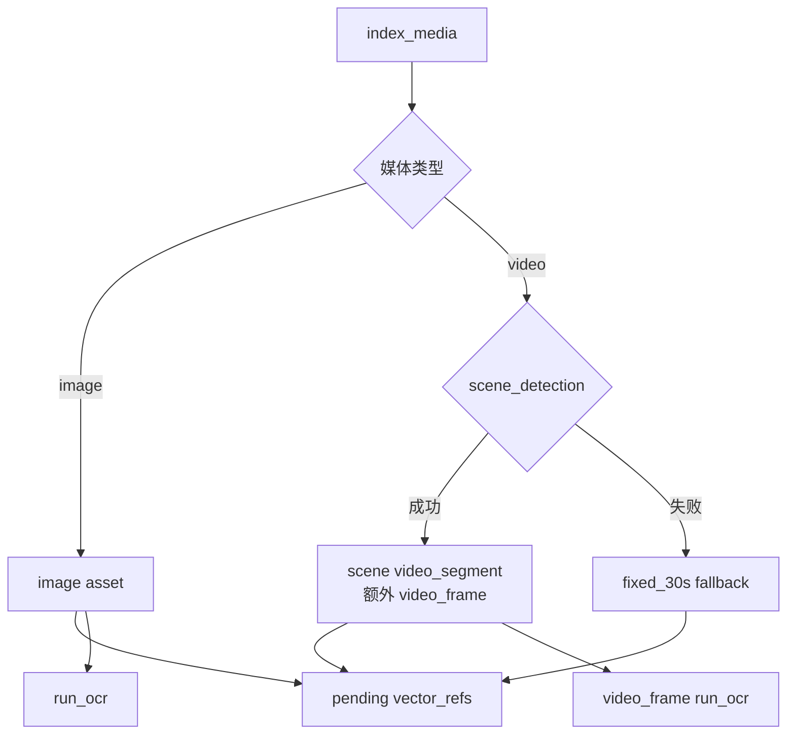
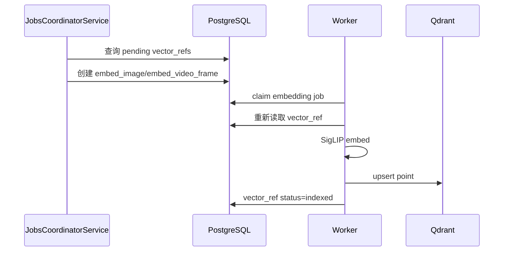
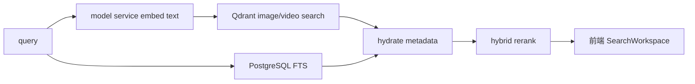

# 核心工作流

## 工作流一：注册素材库并扫描

**是什么**：用户在前端创建 library，然后触发 scan job。

**为什么需要**：系统需要知道哪些本地目录属于媒体库，并以增量方式发现可处理文件。

关键代码：

- `apps/server/src/libraries/libraries.service.ts`
- `apps/worker-py/media_agent_worker/scan.py`

## 工作流二：探测与视觉索引准备

**是什么**：`probe_media` 读取媒体 metadata，随后创建 `index_media` 和转写 job。

**为什么需要**：后续索引需要 duration、尺寸、codec 等基础信息；视频和音频还需要进入转写流程。

关键代码：

- `apps/worker-py/media_agent_worker/probe.py`
- `apps/worker-py/media_agent_worker/repository.py`

## 工作流三：视频切片与 pending vector refs

**是什么**：`index_media` 为图片、视频场景、视频关键帧创建 `media_assets` 和 pending `vector_refs`。

**为什么需要**：这个阶段只定义“要索引什么”，不跑模型。这样资产生成和模型推理可以分开重试。

关键代码：

- `apps/worker-py/media_agent_worker/indexing.py`
- `apps/worker-py/media_agent_worker/repository.py`

## 工作流四：Embedding 写入 Qdrant

**是什么**：Server 的 `JobsCoordinatorService` 自动扫描 pending `vector_refs` 并创建 embedding jobs；catch-up endpoint 保留为手动补漏入口。worker 生成向量、写 Qdrant、标记 indexed。

**为什么需要**：索引准备和模型推理解耦，避免大向量穿过 TypeScript/Python job input，也避免 HTTP server 负担模型推理。

关键代码：

- `apps/server/src/jobs/jobs.service.ts`
- `apps/worker-py/media_agent_worker/embedding_worker.py`
- `apps/worker-py/media_agent_worker/qdrant.py`

## 工作流五：搜索

**是什么**：用户输入 query，系统同时做视觉向量召回和文本 FTS，再合并排序。

**为什么需要**：媒体搜索的命中来源不同：画面、讲话内容、图片/视频文字。统一结果列表让用户更容易消费。

关键代码：

- `apps/server/src/search/search.service.ts`
- `apps/server/src/search/search-hybrid.ts`
- `apps/web/components/search-workspace.tsx`

## 工作流六：转写与文本检索

**是什么**：`transcribe_audio` 从视频或音频抽音轨，用 faster-whisper 转写，再按 15-30 秒窗口创建 `text_chunk`。

**为什么需要**：用户常按“说了什么”搜索视频或音频。

关键代码：

- `apps/worker-py/media_agent_worker/transcription.py`
- `apps/server/src/database/repositories.ts` 的 `listTextSearchResultMetadata()`

## 工作流七：OCR 与画面文字检索

**是什么**：`run_ocr` 对 image 或 video_frame 读图，识别文字后写回 asset 的 `text_content` 和 `metadata_json.ocr`。

**为什么需要**：视频画面字幕、屏幕文字、图片海报文字需要被搜索，并与 transcript 命中原因区分。

关键代码：

- `apps/worker-py/media_agent_worker/ocr.py`
- `apps/server/src/search/search.service.ts` 的 `textSearchReason()`

## 工作流八：剪辑导出

**是什么**：Media Detail 或 Agent 确认创建 `export_clip` job，worker 用 FFmpeg 输出文件。

**为什么需要**：搜索之后的实际产出是可用片段，导出必须异步且可观察。

关键代码：

- `apps/server/src/clips/clips.service.ts`
- `apps/worker-py/media_agent_worker/exporting.py`
- `apps/web/components/media-detail-workspace.tsx`

## 工作流九：Agent 任务

**是什么**：用户给 Agent prompt；如果外部 LLM 未启用，server 只记录 run；如果启用，LLM 可以调用搜索和详情工具，副作用工具等待用户确认。

**为什么需要**：Agent 是高级协调入口，不是替代搜索引擎。它可以把“找候选、看详情、建议导出”串起来，但写入动作必须由服务端和用户确认守住。

关键代码：

- `apps/server/src/agent/agent.service.ts`
- `apps/server/src/agent/agent.tools.ts`
- `apps/web/components/agent-workspace.tsx`
