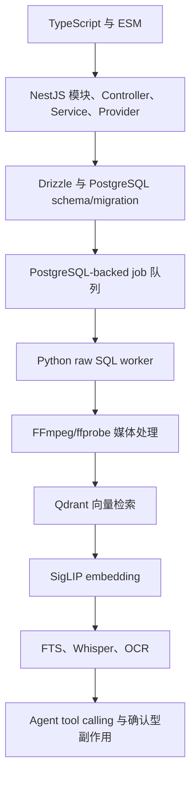

# 源码阅读路径

## 适合谁读

这份路径适合准备贡献代码或系统性理解项目的人。假设读者熟悉 TypeScript 基础和 Web API，但不一定熟悉 NestJS、Drizzle、Qdrant、FFmpeg、Python worker 或本地多模态模型。

## 前置知识模块

## 目录从读者视角怎么理解

| 目录 | 先读程度 | 作用 |
| --- | --- | --- |
| `packages/shared` | 必读 | 理解跨语言 job 类型、media 类型、schema 权威 |
| `apps/server/src/database` | 必读 | 理解事实数据、job、repository、迁移检查 |
| `apps/server/src/search` | 必读 | 理解搜索主链路和 hybrid rerank |
| `apps/worker-py/media_agent_worker` | 必读 | 理解扫描、索引、模型、转写、OCR、导出 |
| `apps/server/src/jobs` | 必读 | 理解 server 如何创建和协调 worker jobs |
| `apps/server/src/agent` | 中后期读 | 理解 LLM 默认关闭、工具脱敏、副作用确认 |
| `apps/web` | 中后期读 | 理解前端如何消费 API，不承担业务事实 |
| `docs` | 先读部分 | 架构文档和任务记录能解释很多“为什么” |
| `infra` | 运行时读 | 了解 PostgreSQL/Qdrant/Redis compose |
| `tests` | 配合读 | 用测试确认行为边界 |

## 推荐阅读顺序

### 第一段：协议和常量

1. `packages/shared/constants/index.ts`
2. `packages/shared/schemas/index.ts`
3. `packages/shared/scripts/generate-json-schemas.ts`
4. `packages/shared/generated/job-schemas.json`

先看这里是因为 job 类型和输入输出决定了 TypeScript 和 Python 能说什么话。理解 `scan_library`、`probe_media`、`index_media`、`embed_image`、`embed_video_frame`、`transcribe_audio`、`run_ocr`、`export_clip` 后，再读实现会更顺。

### 第二段：数据库事实模型

1. `apps/server/src/database/schema.ts`
2. `apps/server/drizzle/0000_tense_starfox.sql`
3. `apps/server/drizzle/0001_phase_12_transcripts.sql`
4. `apps/server/src/database/repositories.ts`
5. `apps/server/src/database/schema-guard.service.ts`

重点理解：

- `libraries`、`media_files`、`media_assets`、`vector_refs` 的关系。
- `jobs` 表为什么能当队列。
- `agent_*` 表为什么是审计记录。
- `media_assets.text_content` 和 `text_tsv` 为什么承载 transcript/OCR。

### 第三段：后端模块入口

1. `apps/server/src/app.module.ts`
2. `apps/server/src/main.ts`
3. `apps/server/src/config/settings.ts`
4. `apps/server/src/health/*`

这些文件让你知道 NestJS 怎么组装、`.env` 怎么加载、健康检查依赖哪些服务。

### 第四段：Library 和 Jobs

1. `apps/server/src/libraries/libraries.controller.ts`
2. `apps/server/src/libraries/libraries.service.ts`
3. `apps/server/src/jobs/jobs.controller.ts`
4. `apps/server/src/jobs/jobs.service.ts`

重点理解 server 只创建和协调 job，不自己跑媒体处理。

### 第五段：Python worker 主链路

1. `apps/worker-py/media_agent_worker/worker.py`
2. `apps/worker-py/media_agent_worker/repository.py`
3. `apps/worker-py/media_agent_worker/scan.py`
4. `apps/worker-py/media_agent_worker/probe.py`
5. `apps/worker-py/media_agent_worker/indexing.py`

读法建议：

- 先看 `WorkerRunner.run_once()` 怎么分发。
- 再看 repository 中每个写库函数。
- 最后看 handler 如何把一个 job 扩展成下游 jobs。

### 第六段：Embedding 与 Qdrant

1. `apps/server/src/qdrant/vector-collections.ts`
2. `apps/server/src/qdrant/qdrant-collections.service.ts`
3. `apps/server/src/model-gateway/model-gateway.service.ts`
4. `apps/server/src/search/search-query-vector.service.ts`
5. `apps/worker-py/media_agent_worker/embeddings.py`
6. `apps/worker-py/media_agent_worker/embedding_worker.py`
7. `apps/worker-py/media_agent_worker/model_service.py`
8. `apps/worker-py/media_agent_worker/qdrant.py`

关键问题：

- 为什么 query embedding 同步，媒体 embedding 异步？
- collection 维度变化为什么要重建？
- payload 为什么不能当事实源？

### 第七段：Search

1. `apps/server/src/search/search.service.ts`
2. `apps/server/src/search/search-hybrid.ts`
3. `apps/server/tests/search/search.service.test.ts`
4. `apps/server/tests/search/search-hybrid.test.ts`

这里是项目最核心的用户价值。建议先读测试，再读实现，因为测试直接说明合并和排序语义。

### 第八段：转写、OCR、导出

1. `apps/worker-py/media_agent_worker/transcription.py`
2. `apps/worker-py/media_agent_worker/ocr.py`
3. `apps/worker-py/media_agent_worker/exporting.py`
4. `apps/server/src/clips/clips.service.ts`

重点理解这些都是派生能力：写回 PostgreSQL 或本地 exports，不改变源文件。

### 第九段：Agent

1. `apps/server/src/agent/agent.service.ts`
2. `apps/server/src/agent/agent.tools.ts`
3. `apps/server/src/agent/agent-model.runner.ts`
4. `apps/server/tests/agent/agent.controller.test.ts`

先看默认关闭，再看 tool 脱敏和确认机制。不要从 AI SDK 调用细节开始，先理解隐私和副作用边界。

### 第十段：前端

1. `apps/web/lib/api-client.ts`
2. `apps/web/components/search-workspace.tsx`
3. `apps/web/components/library-workspace.tsx`
4. `apps/web/components/jobs-workspace.tsx`
5. `apps/web/components/media-detail-workspace.tsx`
6. `apps/web/components/agent-workspace.tsx`

前端读法：看它如何把后端结果显示成工作流，而不是看它如何实现业务逻辑。业务事实基本不在前端。

## 可以暂时跳过的目录

- `apps/*/node_modules`：依赖目录。
- `.venv`：Python 虚拟环境。
- `apps/web/public`：静态资源，除非调 UI。
- `apps/server/drizzle/meta`：需要排查 migration drift 时再读。
- 大多数测试可以按模块配合阅读，不必一开始全读。

## 最短理解路径

如果只想在一小时内抓住主线：

1. `README.md`
2. `docs/architecture.md`
3. `packages/shared/schemas/index.ts`
4. `apps/server/src/database/schema.ts`
5. `apps/worker-py/media_agent_worker/worker.py`
6. `apps/worker-py/media_agent_worker/indexing.py`
7. `apps/server/src/search/search.service.ts`
8. `apps/server/src/search/search-hybrid.ts`
9. `apps/web/components/search-workspace.tsx`

读完这 9 个入口，基本能解释系统是什么、为什么分进程、搜索如何返回结果。
