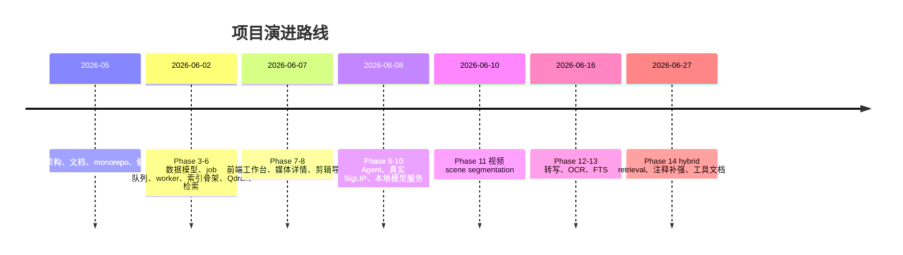
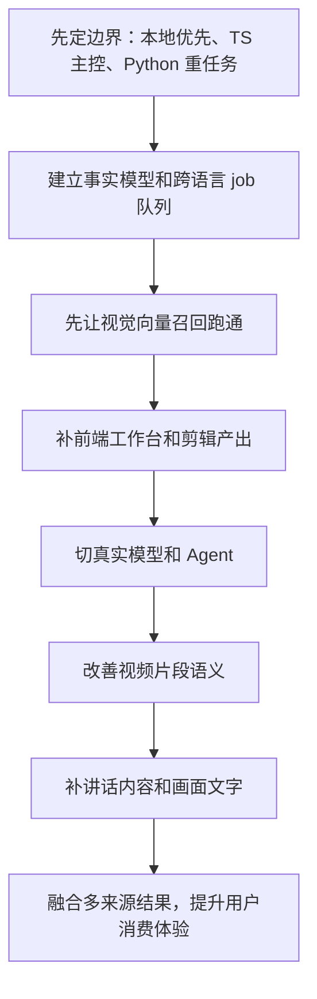

# 系统演进历史

## 证据来源

本文件基于 `git log --oneline --decorate --max-count=80`、关键目录 `git log --name-status`、commit stat，以及 `docs/tasks/todo.md` 的阶段 Review。由于提交粒度较大，某些细节是从 commit 文件变更和当前代码推断，已在对应阶段注明。

## 时间线概览

## 阶段一：初始化与架构定调

提交：`64be1ea feat:init`

**显式证据**：

- 新增 `README.md`、`DESIGN.md`、`docs/architecture.md`、`docs/job-protocol.md`、`docs/vector-index-design.md`、`docs/implementation-plan.md`。
- 新增 `apps/server`、`apps/web`、`apps/worker-py`、`packages/shared`、`infra`。
- server 初始已有 health、config、dependency checks。

**演进判断**：

这一步不是先写功能，而是先确定产品和架构约束：本地优先、TypeScript 主控、Python worker、PostgreSQL、Qdrant、任务协议和向量结构。这说明项目从 Day 0 就把“边界”视为核心问题。

## 阶段二：数据模型、job 队列和索引骨架

提交：`96ea840 feat：phase3 4 5`

**显式证据**：

- 新增 Drizzle schema、migration、repository。
- 新增 `jobs`、`libraries`、`media_files`、`media_assets`、`vector_refs`。
- 新增 Python worker 的 `scan.py`、`probe.py`、`indexing.py`、`qdrant.py`、`repository.py`、`worker.py`。
- 新增 shared constants、schemas、生成 JSON Schema。
- 新增 Qdrant collection registry。

**演进判断**：

这一阶段建立了“事实模型 + 跨语言任务队列 + worker 执行”的骨架。索引最初可用 mock vectors 或骨架写入来验证回路，真实模型留到后续阶段。

## 阶段三：Qdrant Retrieval

提交：`d1c2fd3 feat：phase6`

**显式证据**：

- 新增 `apps/server/src/search/search.controller.ts`、`search.module.ts`、`search.service.ts`、`search-query-vector.service.ts`。
- repository 增加 search hydration 查询。
- Qdrant module 接入 client 和 collection 初始化增强。

**演进判断**：

系统从“能生成索引骨架”进入“能被用户查询”。这一阶段重点是从 Qdrant 召回 point 后回 PostgreSQL 补齐 metadata，确认 Qdrant 不是事实源。

## 阶段四：前端工作台与剪辑导出

提交：`f0f2e13 feat:phase 7 - 8`

**显式证据**：

- 新增 `apps/web/app/*` 页面、多个 workspace 组件、`api-client.ts`。
- 新增 `apps/server/src/media`、`clips` 模块。
- 新增 Python `exporting.py`。

**演进判断**：

系统开始从后端能力变成可操作产品。Media Detail 和 export clip 说明搜索结果开始连接到真实产出。

## 阶段五：Agent 与真实视觉 embedding

提交：`160a5f0 feat:phase 9-10`

**显式证据**：

- 新增 `apps/server/src/agent/*`。
- 新增 `apps/server/src/model-gateway/*`。
- 新增 Python `embeddings.py`、`embedding_worker.py`、`model_service.py`。
- Qdrant registry 切到 SigLIP，worker requirements 增加模型依赖。
- jobs service 增加 pending embedding 协调。

**演进判断**：

这是从 mock 或骨架检索切到真实语义检索的关键阶段，同时引入 Agent。重要设计是仍然默认外部 LLM 关闭，并把 query embedding 与媒体 embedding 分开。

## 阶段六：视频场景切分

提交：`43d30fe feat:phase 11`

**显式证据**：

- `indexing.py` 大幅扩展 scene detection、keyframe、fallback、stale invalidation。
- `requirements.txt` 增加 `scenedetect`。
- search/media 返回 scene metadata。
- shared schema 增加 segment strategy 和 fallback 字段。

**演进判断**：

系统认识到固定 30 秒切片不够语义化，于是引入 scene detection。为控制复杂度，没有新增表，而是把 scene 信息写入 `metadata_json`。

## 阶段七：语音转写、OCR 与 FTS

提交：`13a4099 feat:phase 12 - 13`

**显式证据**：

- 新增 migration `0001_phase_12_transcripts.sql`。
- 新增 `transcription.py`、`ocr.py`。
- search service 增加 FTS 文本搜索。
- jobs service 增加 OCR queue-pending。
- shared schema 增加 `transcribe_audio`、`run_ocr`。

**演进判断**：

搜索从纯视觉语义扩展到讲话内容和画面文字。这里选择 PostgreSQL FTS，而不是马上引入文本 embedding，体现了先把链路打通、后续再优化语义召回的策略。

## 阶段八：Hybrid Retrieval 与可读性补强

提交：`a2f7256 feat: phase 14`

**显式证据**：

- 新增 `apps/server/src/search/search-hybrid.ts`。
- `search.service.ts` 输出 top-level `results`，保留 `groups`。
- 新增大量 server/web/worker 测试。
- README 大幅更新，新增 `docs/tools.md`，源码注释补强。
- `docs/tasks/lessons.md` 新增 hybrid retrieval 规则经验。

**演进判断**：

这是从“多个来源能查到”进入“用户看到一个统一答案”的阶段。核心变化不是新增模型，而是定义合并后语义、分页时机、分数归一化和解释理由。

## 历史演进的主线

## 重要转折

1. **从 Fastify 思路转向 NestJS 模块化**：`docs/tasks/lessons.md` 记录可维护性优先。
2. **从 Python 主后端转向 TypeScript 主控**：同一文件记录 Python 只做重任务 worker。
3. **从 mock/骨架向量转向 SigLIP**：Phase 10 引入 model service 和 embedding jobs。
4. **从单来源召回转向 hybrid results**：Phase 14 通过纯函数固定合并语义。
5. **从“Agent 执行者”转向“Agent 协调者”**：副作用工具必须确认，外部 LLM 默认关闭。
