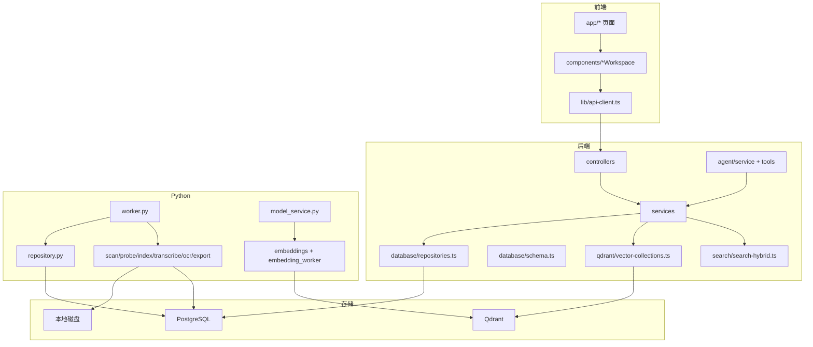
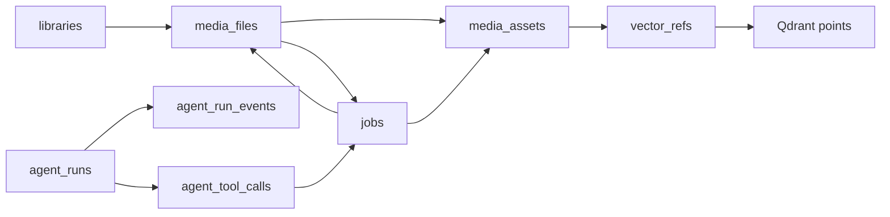

# 实现地图

## 从历史阶段到当前模块

| 历史阶段 | 当前模块 | 当前职责 |
| --- | --- | --- |
| 初始化架构 | `docs/*`、`README.md` | 保存目标、边界、启动方式和协议说明 |
| 数据模型 | `apps/server/src/database/schema.ts` | TypeScript schema 权威 |
| 跨语言协议 | `packages/shared/schemas/index.ts` | job input/output 事实来源 |
| job 队列 | `apps/server/src/jobs`、`apps/worker-py/media_agent_worker/worker.py` | 创建、claim、执行、回收任务 |
| 扫描与探测 | `scan.py`、`probe.py` | 发现文件、读取 metadata、触发下游任务 |
| 索引骨架 | `indexing.py`、`repository.py` | 创建 assets 与 vector refs |
| Qdrant 检索 | `qdrant/*`、`search.service.ts` | collection 管理、向量召回、回表 |
| 前端工作台 | `apps/web` | 用户操作和状态展示 |
| 剪辑导出 | `clips.service.ts`、`exporting.py` | 创建导出 job，FFmpeg 输出 |
| Agent | `agent/*` | LLM tool calling、脱敏、确认 |
| 真实 embedding | `model-gateway/*`、`embeddings.py`、`model_service.py`、`embedding_worker.py` | query embedding 和媒体 embedding |
| scene segmentation | `indexing.py`、`media.service.ts`、`search.service.ts` | 场景资产、关键帧、scene_id 展示 |
| 转写/OCR | `transcription.py`、`ocr.py`、FTS 查询 | 文本内容写入和搜索 |
| hybrid retrieval | `search-hybrid.ts` | 统一结果合并和排序 |

## 当前运行组件地图



## 接口地图

| HTTP 接口 | Controller/Service | 下游 |
| --- | --- | --- |
| `GET /health` | `HealthController`、`HealthService` | PostgreSQL/Qdrant 依赖检查 |
| `POST /libraries` | `LibrariesController`、`LibrariesService` | `createLibrary()` |
| `POST /libraries/{id}/scan` | `LibrariesService` | 创建 `scan_library` job |
| `GET /jobs` | `JobsController`、`JobsService` | 查询 `jobs` |
| `JobsCoordinatorService` | `JobsService` | 自动将 pending `vector_refs` 转 embedding jobs |
| `POST /jobs/embedding/queue-pending` | `JobsService` | 手动补漏 pending `vector_refs` 转 embedding jobs |
| `POST /jobs/ocr/queue-pending` | `JobsService` | pending OCR assets 转 `run_ocr` jobs |
| `POST /search` | `SearchController`、`SearchService` | model service、Qdrant、FTS、hybrid |
| `GET /media/{id}` | `MediaController`、`MediaService` | 文件和 assets 查询 |
| `POST /clips/export` | `ClipsController`、`ClipsService` | 创建 `export_clip` job |
| `POST /agent/runs` | `AgentController`、`AgentService` | Agent run、tools、events |
| `POST /agent/runs/{id}/confirm` | `AgentService` | 确认后创建 job |

## 存储和状态地图



## 关键调用链地图

### 搜索调用链

```text
SearchController.search
→ SearchService.search
→ SearchQueryVectorService.embedQuery
→ ModelGatewayService.embedText
→ QdrantClient.search
→ listSearchResultMetadata
→ listTextSearchResultMetadata
→ buildHybridResults
```

### 扫描索引调用链

```text
LibrariesService.scanLibrary
→ createJob(scan_library)
→ WorkerRunner.run_once
→ ScanHandler.handle
→ PostgresMediaRepository.upsert_media_file
→ create_job(probe_media)
→ ProbeHandler.handle
→ create_job(index_media/transcribe_audio)
→ IndexMediaHandler.handle
→ upsert_media_asset
→ upsert_vector_ref
```

### Embedding 调用链

```text
JobsService.queuePendingEmbeddingJobs
→ listPendingEmbeddingVectorRefs
→ createJob(embed_image/embed_video_frame)
→ WorkerRunner.run_once
→ EmbedImageHandler/EmbedVideoFrameHandler
→ SiglipEmbedder.embed_image_path
→ QdrantHttpClient.upsert_point
→ mark_vector_ref_indexed
```

### Agent 调用链

```text
AgentController.createRun
→ AgentService.createRun
→ createAgentRun + createAgentRunEvent
→ AgentModelRunner.run
→ createAgentTools
→ persistToolCalls
→ confirmToolCall
→ createConfirmedJob
```

## 当前实现的组织特点

1. **Service 层偏编排**：例如 `SearchService` 负责整合 model service、Qdrant、FTS 和 hybrid 函数；`JobsService` 负责把 pending 状态转成 worker jobs。
2. **Repository 层偏集中**：`apps/server/src/database/repositories.ts` 集中了大量查询，Python `repository.py` 也集中 raw SQL。
3. **Worker handler 偏单职责**：scan、probe、index、embedding、transcribe、OCR、export 分文件实现。
4. **复杂排序做成纯函数**：`search-hybrid.ts` 不依赖数据库，便于测试和调整。
5. **前端是薄层**：workspace 组件只调用 API 和展示状态。
