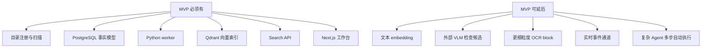

# Day 0 产品与技术方案复原

## 复原方法

本文件不是未来方案，而是从当前源码、文档和 Git 历史反推作者在开工第一天可能如何定义产品和技术边界。证据等级：

- **高**：README、架构文档、源码结构直接支持。
- **中**：任务记录、lessons、commit 演进支持。
- **低**：由当前实现形态推断。

## Day 0 产品判断

### 目标用户

拥有大量本地媒体素材的人，尤其视频素材较多，需要在本机完成搜索、定位和剪辑导出。

证据等级：高。`README.md` 明确目标规模约 1 TB、视频为主、本地优先。

### 核心任务

1. 注册本地目录。
2. 扫描媒体文件。
3. 为图片和视频生成视觉索引。
4. 搜索图片、视频、音频讲话和画面文字。
5. 查看媒体详情与片段。
6. 导出剪辑。
7. 用 Agent 协调搜索和导出建议。

证据等级：高。README、API contract、web 页面和 server modules 均覆盖这些任务。

### 明确不做

1. 默认不上传源媒体。
2. 默认不调用外部 LLM。
3. 不把 Qdrant 当主数据库。
4. 不让 Python 拥有产品 API 和 schema。
5. 不在 HTTP 请求里执行重媒体任务。

证据等级：高。README、architecture、lessons 和源码边界均支持。

## Day 0 MVP 边界

## Day 0 技术方案

### 主控层

选择 TypeScript + NestJS。

**理由复原**：前端、API contract、schema、Agent tool schema 都在 TypeScript 生态中；NestJS 提供模块化边界。

证据等级：高。`docs/tasks/lessons.md` 记录“主语言改为 TypeScript，Python 只做重任务 worker”和“NestJS 默认 Express adapter”。

### Worker 层

选择 Python worker，但不使用 Python Web 框架做主后端。

**理由复原**：媒体处理和模型推理生态在 Python；但产品 API、状态和 schema 更适合 TypeScript 主控。

证据等级：高。`apps/worker-py` 只有 worker 和 model service，业务 API 全在 NestJS。

### 队列

选择 PostgreSQL-backed jobs。

**理由复原**：本地 MVP 需要可恢复任务状态，而不需要额外队列基础设施；跨语言访问 PostgreSQL 比让 TS 绑定 Python 队列协议更直接。

证据等级：高。`docs/job-protocol.md` 和 `repository.py` 直接实现。

### 向量检索

选择 Qdrant，按模态和用途拆 collection。

**理由复原**：图片、视频帧、视频片段、音频文本、文本 chunk 的模型和维度可能不同，分 collection 更容易重建和排错。

证据等级：高。`docs/vector-index-design.md` 和 `vector-collections.ts` 一致。

### 本地模型

视觉使用 SigLIP，转写使用 faster-whisper，OCR 使用 PaddleOCR。

**理由复原**：都能本地运行，能满足默认不调用外部服务。SigLIP 提供 text/image embedding；faster-whisper 与 PaddleOCR 是成熟本地工具。

证据等级：高。`requirements.txt`、`embeddings.py`、`transcription.py`、`ocr.py`。

### 前端

选择 Next.js 工具型工作台。

**理由复原**：用户需要持续操作 Library、Search、Jobs、Media Detail、Agent；不是一次性 CLI。

证据等级：高。`apps/web/app` 和 workspace components。

## 产品压力如何塑造技术选择

| 产品压力 | 技术回应 | 证据 |
| --- | --- | --- |
| 源文件隐私 | 源文件保留本地，外部 LLM 默认关闭 | README、AgentService |
| 视频很大 | job 队列、分片资产、scene detection | `jobs`、`indexing.py` |
| 搜索要快 | query embedding 同步 model service | `SearchQueryVectorService` |
| 索引很慢 | 媒体 embedding 异步 job | `JobsService.queuePendingEmbeddingJobs()` |
| 结果要可解释 | `reason`、`primary_reason`、`source_scores` | `search-hybrid.ts` |
| 剪辑有副作用 | export job + Agent 确认 | `clips.service.ts`、`AgentService.confirmToolCall()` |
| 跨语言易漂移 | shared Zod schema + JSON Schema | `packages/shared` |

## 作者 Day 0 可能写下的技术原则

1. TypeScript 拥有 schema 和业务编排。
2. Python 只做媒体和模型重任务。
3. PostgreSQL 是事实源，Qdrant 是召回索引。
4. 所有长任务都进入 job 队列。
5. Query embedding 必须同步，媒体 embedding 可以异步。
6. 外部 LLM 默认关闭，副作用必须确认。
7. 先让端到端链路可靠，再优化模型质量和召回质量。

## 复原结论

这个项目 Day 0 的真实核心很可能不是“做一个 AI 相册”，而是“用本地可控的系统，把个人媒体库变成可索引、可搜索、可剪辑、可审计的工作台”。当前实现高度符合这个初始意图。
