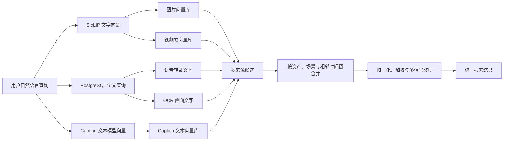
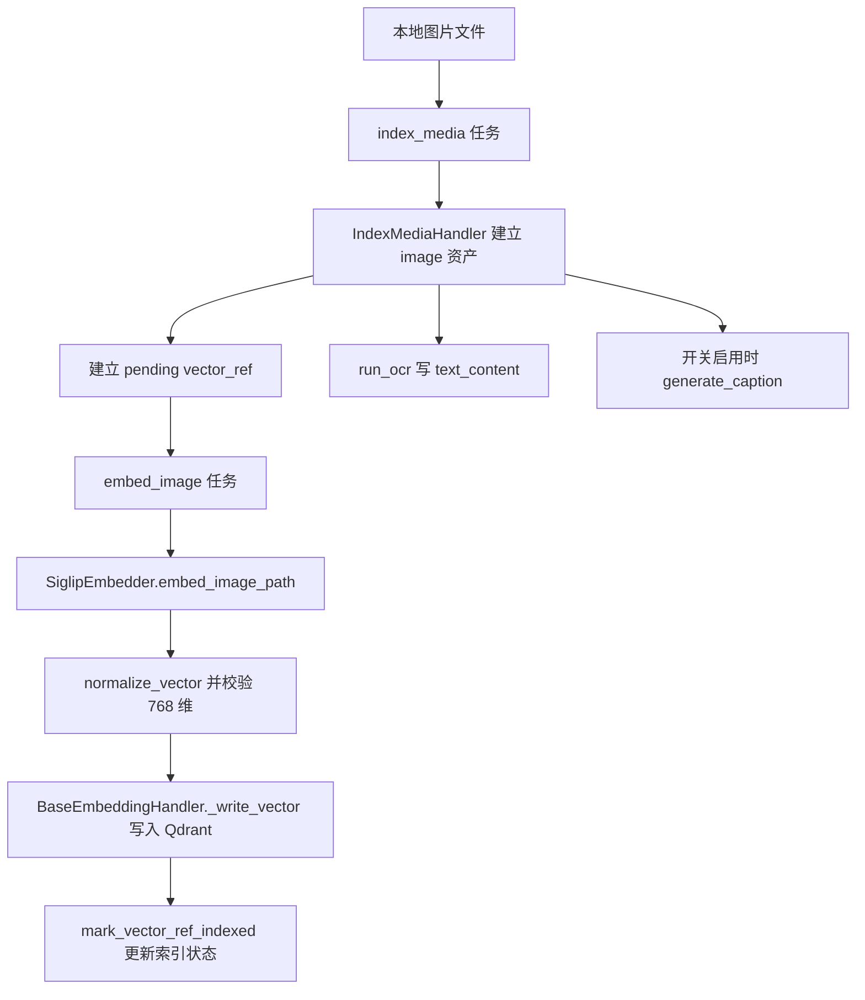
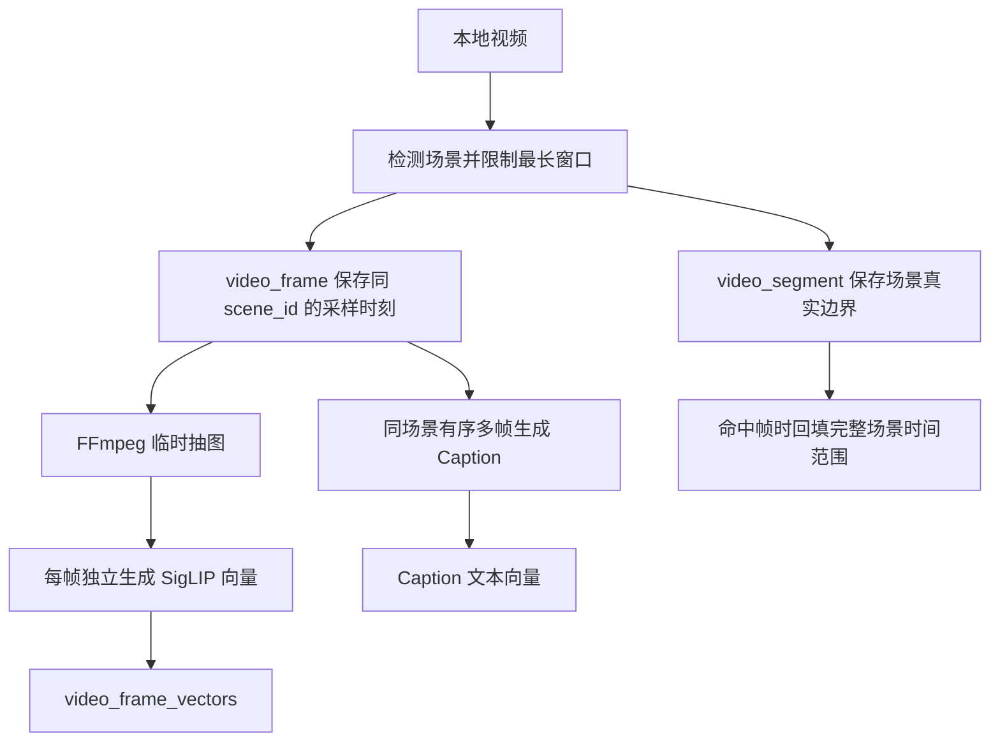
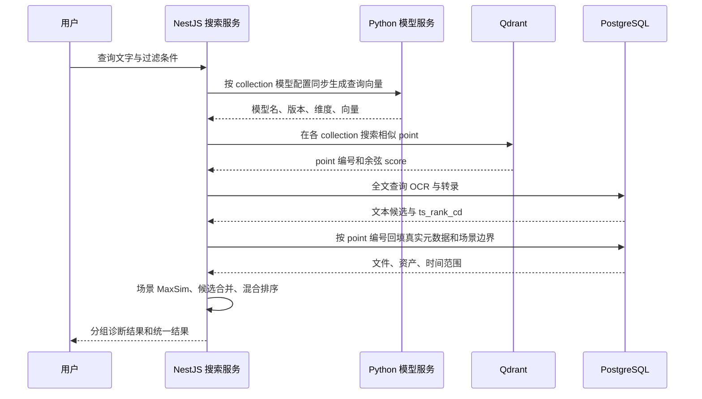

# 核心机制：多模态索引与检索

## 这是什么机制

**它是什么**：系统先把图片、视频画面、语音和画面描述加工成可搜索的“资产”，再分别建立向量索引或全文索引；用户输入一句话后，系统从多个通道各自找候选，最后合并成统一结果。

**为什么需要它**：用户记得的线索并不统一。有人记得“海边日落”的视觉内容，有人记得视频里说过的台词，有人只记得画面上的招牌文字，也有人用“一个人在厨房切菜”这类抽象描述。单一检索方式不可能同时覆盖这些线索。

**设计核心**：不同信号先在最适合自己的空间里检索，再在候选层合并。视觉向量进入 Qdrant；转录和 OCR 文本进入 PostgreSQL 全文检索；VLM 生成的 Caption 先变成文本向量再进入独立的 Qdrant collection。PostgreSQL 始终是事实来源，Qdrant 只负责相似候选召回（`docs/vector-index-design.md`；`apps/server/src/search/search.service.ts: SearchService`）。

> 面试时可以先用一句话概括：**索引阶段把媒体变成机器可比较的表示，检索阶段把查询变成同类表示去召回候选，最后融合视觉、台词、画面文字和描述四类证据。**

---

## 先把五个名词串起来

### Transformer：模型理解上下文的一类基础结构

Transformer 不是这个项目中的一个独立服务，也不是数据库。可以先把它理解成一种“让模型根据上下文提取特征”的神经网络结构。文字经过切词后，模型会结合上下文形成每个词的特征；视觉模型也可以把图片切成小块，再分析各图片块之间的关系。

本项目通过 Hugging Face `transformers` 库加载具体模型，而不是自己实现 Transformer：

- `SiglipEmbedder` 用 `AutoProcessor` 和 `AutoModel` 加载 SigLIP；
- `TransformerTextEmbedder` 用 `AutoTokenizer` 和 `AutoModel` 加载 Caption 文本向量模型；
- `TransformersQwenVlCaptioner` 可用 `Qwen2_5_VLForConditionalGeneration` 读取多张图片并生成描述。

对应源码为 `apps/worker-py/media_agent_worker/embeddings.py: SiglipEmbedder、TransformerTextEmbedder` 和 `apps/worker-py/media_agent_worker/vlm_service.py: TransformersQwenVlCaptioner`。因此面试中不要说“项目使用 Transformer 做检索”，更准确的说法是：“项目使用基于 Transformer 的具体预训练模型生成特征或 Caption。”

### Embedding：把内容翻译成一串可比较的数字

Embedding（向量表示）可以理解为模型为内容生成的“语义坐标”。相似内容在这个坐标空间里通常更接近。例如，一张狗的图片和“狗在草地奔跑”这句话，经过兼容的图像编码器和文本编码器后，应落到较接近的位置。

项目当前有两套不可混用的坐标系：

| 坐标系 | 媒体侧输入 | 查询侧输入 | 维度 | 代码依据 |
| --- | --- | --- | ---: | --- |
| SigLIP | 图片或视频帧 | 查询文字 | 768 | `embeddings.py: SiglipEmbedder.embed_image_path、embed_text`；`vector-collections.ts: SIGLIP_VECTOR_DIM` |
| Caption 文本模型 | VLM 生成的描述文字 | 查询文字 | 384 | `embeddings.py: TransformerTextEmbedder.embed_text`；`vector-collections.ts: CAPTION_TEXT_EMBEDDING_VECTOR_DIM` |

维度只是数字个数，不代表准确率。768 维也不能简单理解为一定比 384 维更准。真正重要的是：**存入某个 collection 的媒体向量与查询向量必须来自同一模型、同一版本、同一维度。** `ModelGatewayService.embedText` 会校验返回的模型名、版本和维度，不匹配就直接报错（`apps/server/src/model-gateway/model-gateway.service.ts: embedText`）。

### SigLIP：让文字和图片能在同一个空间比较

SigLIP 是本项目的视觉语义模型。它提供图片侧和文字侧两种编码能力：离线时把图片或视频帧编码成 768 维向量；在线搜索时把用户文字编码成同一空间的 768 维向量。因此它支持“以文搜图”和“以文搜视频画面”（`apps/worker-py/media_agent_worker/embeddings.py: SiglipEmbedder`）。

它解决的是画面语义，不等价于 OCR，也不等价于 Caption：

- SigLIP 尝试判断“画面整体像什么”；
- OCR 读取“画面上明确写了什么字”；
- Caption 让视觉语言模型先把画面转换成一句自然语言描述。

### Qdrant：按向量距离找邻居的数据库

Qdrant 保存 point，每个 point 至少包含确定性编号、向量和少量过滤字段。它接到查询向量后，返回最相似的若干 point。项目按用途拆分 collection，例如 `image_vectors`、`video_frame_vectors` 和 `caption_text_vectors`，因为它们可能使用不同模型、维度和语义（`apps/server/src/qdrant/vector-collections.ts: VECTOR_COLLECTIONS`）。

Qdrant 不是事实数据库。搜索结果从 Qdrant 得到 point 编号后，还会调用 `listSearchResultMetadata` 回 PostgreSQL 获取真实文件、资产和时间边界；不存在于 PostgreSQL 的 point 不会直接展示（`apps/server/src/search/search.service.ts: hydrateResults`）。

### 余弦相似度与 score：方向有多像，不是“答案正确率”

若两个向量分别为 $a$ 和 $b$，余弦相似度为：

$$
\operatorname{cos}(a,b)=\frac{a\cdot b}{\lVert a\rVert\lVert b\rVert}
$$

白话理解：它主要比较两串数字指向的方向是否相近，而不是比较数值总大小。项目在写入前使用 `normalize_vector` 把向量长度归一化，并将所有相关 collection 配成 `Cosine`（`apps/worker-py/media_agent_worker/embeddings.py: normalize_vector`；`apps/worker-py/media_agent_worker/indexing.py: VECTOR_CONFIGS`）。

Qdrant 返回的 `point.score` 在这些 collection 内表示该模型空间中的余弦相似程度。它只能回答：“模型认为查询向量和这个媒体向量有多接近。”它不能回答：

- 结果是否符合用户真实意图；
- 0.7 是否等于 70% 正确率；
- 两个不同模型、不同检索通道的原始分数能否直接比较；
- 排名第一是否真的相关。

例如，某模型可能把“沙滩”与大量蓝黄色画面都判得很近；score 很高，只能说明模型稳定地产生了这种判断，不能证明判断正确。真正的检索质量必须拿搜索结果与人工标注的“哪些结果相关”对照。项目当前代码记录 `top_raw_score` 是为了诊断查询扩展和召回，并没有把它称为准确率（`apps/server/src/search/search.service.ts: searchCollection`）。

混合结果中的 `score` 更不是 Qdrant 原始余弦值：`buildHybridResults` 会把向量分数限制到 0～1，把 PostgreSQL 的 `ts_rank_cd` 用 `x/(x+1)` 映射，再使用向量 0.55、文本 0.45 的权重以及 0.08 的多信号奖励组合（`apps/server/src/search/search-hybrid.ts: normalizeSourceScore、sourceWeight、scoreCandidate`）。因此它是**工程排序分**，不是经过概率校准的置信度。当前 `confidenceForCandidate` 还固定返回 `high`，面试时不应把它当作真实置信度模型（`apps/server/src/search/search-hybrid.ts: confidenceForCandidate`）。

---

## 四条检索通道分别在解决什么

| 通道 | 索引内容 | 查询方式 | 擅长 | 不擅长 | 返回原因 |
| --- | --- | --- | --- | --- | --- |
| 视觉向量 | 图片、视频关键帧的 SigLIP 向量 | 查询文字也转成 SigLIP 向量，在 Qdrant 搜索 | 主体、场景、颜色、动作等整体视觉语义 | 精确台词、细小文字、模型没学好的概念 | `vector_match` |
| OCR | 图片或视频帧上识别到的文字 | PostgreSQL 全文匹配原查询 | 招牌、字幕、截图界面中的明确文字 | 没有文字的画面、OCR 识别错误、同义改写 | `ocr_match` |
| 语音转录 | 音视频语音转成的 `text_chunk` | PostgreSQL 全文匹配原查询 | 视频中说过的原词或句子 | 纯画面内容、转写错误、同义改写 | `transcript_match` |
| Caption | VLM 对图片或同场景多帧生成的描述，再转成文本向量 | 查询转成同一 Caption 文本模型向量，在 Qdrant 搜索 | 把主体、环境、动作和可见文字转成可做语义匹配的自然语言 | VLM 幻觉、描述遗漏、生成和嵌入成本 | `caption_match` |

这四条不是四个“模型投票”这么简单。视觉与 Caption 走两个不同向量空间；OCR 和转录当前走 PostgreSQL 全文检索，并未写入 `text_chunk_vectors`。相关设计在 `docs/vector-index-design.md: audio_segment_vectors、text_chunk_vectors` 明确标为后续能力；当前路由由 `SearchService.textSearchReason` 根据资产类型区分 OCR 与转录（`apps/server/src/search/search.service.ts`）。

---

## 离线索引：媒体怎样变成可搜索数据

### 它是什么，为什么异步

索引是“提前加工素材”的过程。模型推理、视频抽帧、OCR 和转录都可能耗时，如果在用户发起搜索时临时执行，搜索会非常慢。因此系统通过 PostgreSQL job queue 让 Python worker 在后台完成重任务；搜索时只做查询向量和已有索引的读取（`apps/worker-py/media_agent_worker/worker.py: Worker.run_once`；`apps/server/src/search/search-query-vector.service.ts: embedQuery`）。

### 图片索引调用链

关键点是 `IndexMediaHandler` 自己不运行模型，只建立稳定资产和待处理的 `vector_ref`；`EmbedImageHandler` 才执行模型并写 Qdrant。这把“定义要索引什么”和“消耗算力生成向量”分开（`apps/worker-py/media_agent_worker/indexing.py: IndexMediaHandler`；`embedding_worker.py: EmbedImageHandler`）。

point 编号由资产编号、collection、模型名、模型版本、向量种类和内容哈希共同生成 UUIDv5。相同输入重试会 upsert 同一 point，内容或模型变化则会得到新编号（`indexing.py: deterministic_point_id`）。

### 视频索引调用链

视频不能作为一个整体直接塞给当前 SigLIP。系统先用 PySceneDetect 找镜头，再把超过 `SCENE_MAX_SECONDS` 的镜头继续切窗；每个场景选取若干帧，每帧单独生成视觉向量（`indexing.py: detect_scenes_pyscenedetect、split_long_scenes、extra_keyframe_times、IndexMediaHandler._video_asset_inputs`）。

检索时，同一 `(file_id, scene_id)` 的多个命中帧不会全部挤占结果列表。`collapseVideoFramesByScene` 选择分数最高的帧作为证据，同时使用数据库里的 `video_segment` 边界作为最终片段范围，这是一种 MaxSim（取场景内最大相似度）策略（`apps/server/src/search/search-scene-maxsim.ts: collapseVideoFramesByScene`；`search.service.ts: toHybridCandidates`）。

### OCR 和转录索引

OCR 读取图片或视频帧，把保留的文字块拼成 `text_content` 并更新原资产；转录把连续语音片段组合为带起止时间的 `text_chunk` 资产（`apps/worker-py/media_agent_worker/ocr.py: OcrHandler.handle`；`transcription.py: TranscribeHandler.handle、group_segments_into_chunks`）。数据库的 `text_tsv` 生成列和 GIN 索引负责全文检索，查询排名使用 `ts_rank_cd`（`apps/server/src/database/repositories.ts: listTextSearchResultMetadata`）。

“全文检索”更接近找词，而“文本向量检索”更接近找语义。当前 OCR 和转录优先选择前者，优势是简单、可解释、无需额外模型；代价是用户换一种说法时可能召回不到。

### Caption 索引

Caption 是两步转换，而不是 Qwen 直接产出检索向量：

1. `GenerateCaptionHandler` 提取图片或同一场景的有序多帧，通过 `VlmCaptionClient` 请求 VLM 服务生成中文描述；
2. 描述保存为 `caption` 资产并建立 `caption_text_vectors` 的 `vector_ref`；随后 `EmbedTextAssetHandler` 用多语言 MiniLM 将描述转换为 384 维向量。

代码依据为 `apps/worker-py/media_agent_worker/captioning.py: GenerateCaptionHandler.handle`、`vlm_service.py: handle_caption_request`、`embedding_worker.py: EmbedTextAssetHandler.handle`。Caption 仅在 `CAPTION_INDEXING_ENABLED` 和 `LOCAL_VLM_ENABLED` 都开启时由索引流程排队；在线搜索还受 `captionSearchEnabled` 控制（`indexing.py: IndexMediaHandler.handle`；`search.service.ts: availableCollections`）。

---

## 在线检索：一句查询怎样得到结果

### 为什么查询向量不能走 job queue

媒体向量可以慢慢在后台生成；用户搜索却必须立刻得到用于 Qdrant 查询的向量。如果把查询也丢进异步 job queue，搜索请求会等待 worker 排队，延迟不可控。因此服务器同步请求本机 `model_service:4020`（`apps/server/src/search/search-query-vector.service.ts: SearchQueryVectorService.embedQuery`；`apps/worker-py/media_agent_worker/model_service.py: handle_embed_text_request`）。

### 查询模型必须跟 collection 对齐

`SearchService` 遍历选中的 collection，并从 `VECTOR_COLLECTIONS` 读取该 collection 的模型配置。查询图片和视频帧 collection 时走 SigLIP 文字塔；查询 Caption collection 时走 Caption 文本模型。`EmbeddingModelRouter.text_embedder_for` 根据请求的模型名和版本选择对应 embedder，未知组合直接报错（`search.service.ts: search`；`model_service.py: EmbeddingModelRouter`）。

`SearchService.search` 的完整顺序是：校验请求 → 选择 collection → 可选查询扩展 → 为每种模型同步生成查询向量 → Qdrant 各 collection 召回 → PostgreSQL 全文召回 → 回表补元数据 → 视频帧按场景折叠 → 合并相同资产和相邻视频窗口 → 混合排序（`apps/server/src/search/search.service.ts: search、searchCollection、hydrateResults、toHybridCandidates`；`search-hybrid.ts: buildHybridResults`）。

同一模型、版本、维度和查询文字的向量会用 `queryVectorCache` 复用，所以图片与视频帧都使用 SigLIP 时不必重复推理；Caption 因为模型不同仍会生成另一条查询向量（`search.service.ts: embedQuery` 内部闭包）。

---

## 如何正确解释“召回”和“排序”

**召回**是在庞大素材库里先拿出一批可能相关的候选。例如 Qdrant 返回每个 collection 的前若干 point，PostgreSQL 返回文字匹配候选。这个阶段更担心“正确素材根本没有被拿出来”。

**排序**是把已经召回的候选按相关程度重新排列。这个阶段更担心“正确素材已经在候选池里，却排得太靠后”。

项目用 `sourceLimit` 对每个来源过量获取候选，最少 30、最多 300，再合并和分页，避免折叠重复资产或相邻窗口后候选池不足（`search.service.ts: sourceLimit`）。混合排序对同一来源保留最大分数，对多来源命中的候选加奖励；相邻视频时间窗在特定条件下合并（`search-hybrid.ts: mergeSourceScores、scoreCandidate、mergeAdjacentVideoWindows`）。

因此，排查“不准确”时不能只看最终 score：

1. 先看 `groups` 中各原始来源有没有正确素材；
2. 如果所有 group 都没有，是索引、模型或召回问题；
3. 如果某个 group 有而最终结果没有或很靠后，是融合、去重或排序问题；
4. 如果 OCR/转录原文就错了，是上游内容抽取问题；
5. 如果 point 命中但回表消失，要检查 Qdrant 与 PostgreSQL 的引用一致性。

这一可诊断性是代码刻意保留的：响应同时返回 `groups` 和统一 `results`，搜索日志记录查询扩展、向量、全文、混合和总耗时；场景折叠也记录原始帧数、场景数、最佳时间与分数（`search.service.ts: search、searchCollection、toHybridCandidates`）。

---

## 设计决策与面试表达

### 为什么不用一个模型或一个 collection 包办全部内容

不同通道的输入、向量维度、失败方式和可解释性不同。视觉模型擅长整体画面，OCR 擅长精确文字，转录对应语音，Caption 补足画面到语言的桥梁。拆 collection 允许单独升级模型和重建索引，也避免把 768 维和 384 维向量错误混放（`vector-collections.ts: VECTOR_COLLECTIONS`；`docs/vector-index-design.md: Qdrant Collection 划分`）。

### 为什么 PostgreSQL 和 Qdrant 都需要

Qdrant 擅长近邻搜索，但不应承担完整业务事实和任务状态；PostgreSQL 擅长关系、一致性、全文字段和回表。point payload 故意保留少量冗余字段以便过滤和排查，但最终用户元数据仍以 PostgreSQL 为准（`embedding_worker.py: BaseEmbeddingHandler._write_vector`；`search.service.ts: hydrateResults`）。

### 为什么离线媒体 embedding 和在线查询 embedding 要分开

它们使用相同的模型能力，但运行时要求不同：离线媒体处理耗时、可重试、适合 job；在线查询属于请求关键路径，必须同步。`SiglipEmbedder` 可被 worker 和模型服务共享，但调用边界不同（`embeddings.py: SiglipEmbedder`；`embedding_worker.py: BaseEmbeddingHandler`；`model_service.py: run_model_service`）。

### 为什么视频用多帧 MaxSim 而不是平均向量

一个场景的不同帧可能内容差异很大。简单平均可能把显著物体或短暂画面“稀释”。当前方案每帧独立索引，搜索时取场景内最强帧作为相似度证据，同时仍返回完整场景边界；代价是 point 数量和搜索成本增加（`docs/vector-index-design.md: Segment Vector 策略`；`search-scene-maxsim.ts: collapseVideoFramesByScene`）。

### 面试中最稳妥的一段总结

> 我把系统分成离线索引和在线检索两条链路。离线阶段，图片和视频关键帧通过 SigLIP 生成视觉向量并写入 Qdrant；OCR 和 faster-whisper 的结果写入 PostgreSQL 全文索引；可选的 Qwen2.5-VL Caption 会再经过多语言文本模型生成独立文本向量。在线阶段，查询会针对每个 collection 用匹配的模型同步生成查询向量，同时执行全文检索，然后回 PostgreSQL补齐事实字段，按视频场景做 MaxSim，最后融合多路候选。Qdrant 的 score 只是特定模型空间中的余弦相似度，最终 hybrid score 也是工程排序分，都不等于准确率；准确性需要用人工相关性标注的查询集另行评测。

---

## 仍需验证的问题

1. 当前源码定义了模型、通道与排序规则，但没有提供真实媒体库上的人工标注评测结果；因此不能从代码推出“优化后准确率是多少”。
2. `VECTOR_COLLECTIONS` 仍注册 `audio_segment_vectors` 和 `text_chunk_vectors`，但当前转录与 OCR 实际走 PostgreSQL 全文检索；面试时应明确这是预留结构，不要说成已上线的文本向量通道（`vector-collections.ts`；`docs/vector-index-design.md`）。
3. 当前混合排序权重和阈值是工程配置常量，源码能解释其行为，不能证明它们是最优值；需要用标注集做对照实验后才能得出效果结论（`search-hybrid.ts: VECTOR_SOURCE_WEIGHT、TEXT_SOURCE_WEIGHT、MULTI_SIGNAL_BONUS、MIN_HYBRID_SOURCE_SCORE`）。
4. 当前 `confidence` 固定为 `high`，不具备概率意义，不能用于面试中的准确率或置信度主张（`search-hybrid.ts: confidenceForCandidate`）。
