# 索引与检索的数据流

## 先说结论：系统到底在搬运什么数据

这个系统不是把一个文件直接“塞进向量数据库”，而是把同一个文件逐层拆成不同职责的数据：`library` 表示搜索范围，`media_file` 表示磁盘上的原文件，`media_asset` 表示可定位、可搜索的内容单元，`vector_ref` 表示 PostgreSQL 中的向量索引凭证，Qdrant point 才保存真正用于近邻搜索的向量。

这样设计的原因是：Qdrant 擅长回答“哪些向量最像”，但不适合独自承担文件路径、软删除、时间范围、索引状态等业务事实。PostgreSQL 因此是事实来源，Qdrant 是可重建的检索索引。搜索时即使 Qdrant 命中了一个 point，也必须回 PostgreSQL 验证后才能返回给用户。

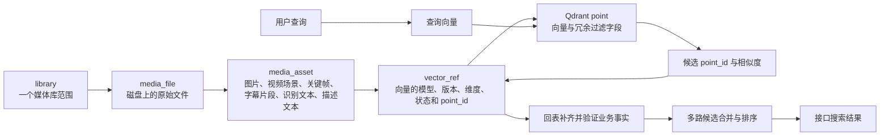

源码依据：数据表定义见 `apps/server/src/database/schema.ts` 的 `libraries`、`mediaFiles`、`mediaAssets`、`vectorRefs`；回表入口见 `apps/server/src/database/repositories.ts` 的 `listSearchResultMetadata()`。

## 一、核心数据结构：它们是什么，为什么存在

### `libraries`：搜索和扫描的边界

**它是什么**：用户注册的一棵本地目录树，关键字段是 `root_path`、状态和软删除时间。

**为什么需要**：一台机器可以有多个媒体库。扫描要从根路径开始，搜索也要能按 `library_id` 限定范围。`root_path` 有唯一约束，防止同一目录被重复注册。

### `media_files`：原始文件事实

**它是什么**：磁盘文件的一条记录，保存绝对路径、相对路径、媒体类型、大小、修改时间、时长、分辨率、编码和 `index_status`。

**为什么不直接把文件当搜索结果**：视频内部几十秒处的画面和语音具有不同语义。文件粒度太粗，不能告诉剪辑工具应跳到哪里；因此文件还要继续拆成 asset。

扫描器 `ScanHandler.handle()` 用“媒体库加绝对路径”识别文件，用大小和修改时间做廉价增量判断。新建或变化的文件置为 `pending`，不变文件跳过。实现见 `apps/worker-py/media_agent_worker/scan.py` 与 `PostgresMediaRepository.upsert_media_file()`。

### `media_assets`：真正可搜索、可定位的内容单元

**它是什么**：一个文件派生出的语义单元：

- 图片形成一个 `image` asset；
- 视频形成若干 `video_segment` 场景边界和若干 `video_frame` 关键帧；
- 视频或音频转写形成 15～30 秒的 `text_chunk`；
- OCR 文本写回 `image` 或 `video_frame` 的 `text_content`；
- 可选的视觉语言模型描述形成 `caption` asset。

**为什么这样建模**：搜索命中需要落到具体画面或时间段，同时视觉、语音、画面文字和描述文本又需要共享文件身份。asset 正好是“文件”和“检索信号”之间的中间层。

asset 的幂等身份不是随机 UUID 本身，而是 `file_id + asset_type + path/时间窗口`。`PostgresMediaRepository.upsert_media_asset()` 先按这组语义字段查找，重跑时更新原记录；并用 JSON 合并保留 OCR 等其他任务后来写入的元数据。

### `vector_refs`：PostgreSQL 与 Qdrant 的桥

**它是什么**：一条“应该存在或已经存在的向量”的账本，保存 asset、文件、媒体库、collection、模型与版本、向量维度、距离算法、内容哈希、索引配置、`point_id` 和状态。

**为什么需要桥接表**：Qdrant 返回的是 point id 和相似度，而接口需要可信的路径、时间、软删除状态和 asset 信息。`vector_ref` 让系统能由 point 精确回到 PostgreSQL；模型升级或内容变化时，也能明确哪些向量应重建。

### Qdrant point：可重建的向量索引项

**它是什么**：`id + vector + payload`。向量用于近邻搜索；payload 冗余保存 `library_id`、`file_id`、asset 类型、时间和场景等字段，便于过滤与排查。

**为什么不是事实来源**：写 Qdrant 和写 PostgreSQL 不是同一个跨系统事务，payload 可能暂时滞后。搜索结果仍由 PostgreSQL 回表确认。实现见 `BaseEmbeddingHandler._write_vector()`。

当前主要 collection 如下：

| collection | 内容 | 模型与维度 | 查询如何进入同一空间 |
|---|---|---|---|
| `image_vectors` | 整张图片 | SigLIP，768 维 | 用 SigLIP 文本塔编码查询 |
| `video_frame_vectors` | 视频关键帧 | SigLIP，768 维 | 用 SigLIP 文本塔编码查询 |
| `caption_text_vectors` | 视觉语言模型生成的描述文本 | 多语言 MiniLM，384 维 | 用同一文本模型编码查询 |

注册表见 `apps/server/src/qdrant/vector-collections.ts` 的 `VECTOR_COLLECTIONS`，Python 对应配置见 `apps/worker-py/media_agent_worker/indexing.py` 的 `VECTOR_CONFIGS`。当前视频主检索路径由 `video_frame_vectors` 承担；旧 `video_segment_vectors` 会在重建时标为 stale，场景边界仍由 `video_segment` asset 提供。

## 二、索引数据生命周期

### 2.1 从媒体库到待生成向量

**它是什么**：耗时任务通过 PostgreSQL `jobs` 表异步串联，避免 HTTP 请求等待扫描、FFmpeg、模型推理。

**为什么这样做**：本地媒体库可能达到 TB 级，任务必须可观察、可失败、可重试。PostgreSQL 已经是事实库，用它兼任队列可以减少本地部署组件，并使任务状态与业务数据一起查询。

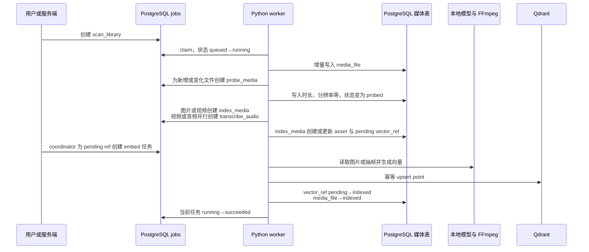

各阶段实现锚点：

- `ScanHandler.handle()`：发现文件并创建 `probe_media`；
- `ProbeHandler.handle()`：写媒体元数据，并并行扇出 `index_media` 与 `transcribe_audio`；
- `IndexMediaHandler.handle()`：创建 asset、`vector_ref`、OCR 和可选 caption 任务；
- `JobsService.queuePendingEmbeddingJobs()`：扫描 pending ref，创建 `embed_image`、`embed_video_frame` 或 `embed_text_asset`；
- `WorkerRunner.run_once()`：分派 handler，成功写 `succeeded`，异常写 `failed`。

### 2.2 图片索引的具体例子

假设媒体库 `/素材` 中新增 `/素材/旅行/海边招牌.jpg`：

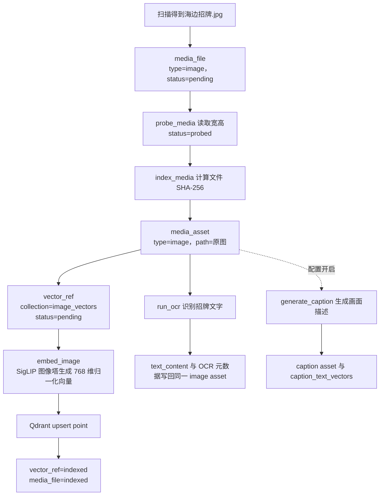

这张图因此可能从三条路被搜到：SigLIP 视觉语义、OCR 的精确文字、caption 的自然语言描述。它们不是三个文件副本，而是围绕同一个 `file_id` 的不同检索信号。

### 2.3 视频索引的具体例子

假设 `滑雪旅行.mp4` 长 95 秒，场景检测得到一段超过 30 秒的连续镜头。系统先合并过短场景，再把过长场景切成最多 30 秒的窗口。每个窗口创建一个 `video_segment` 保存边界，并创建代表帧与额外关键帧 `video_frame`。

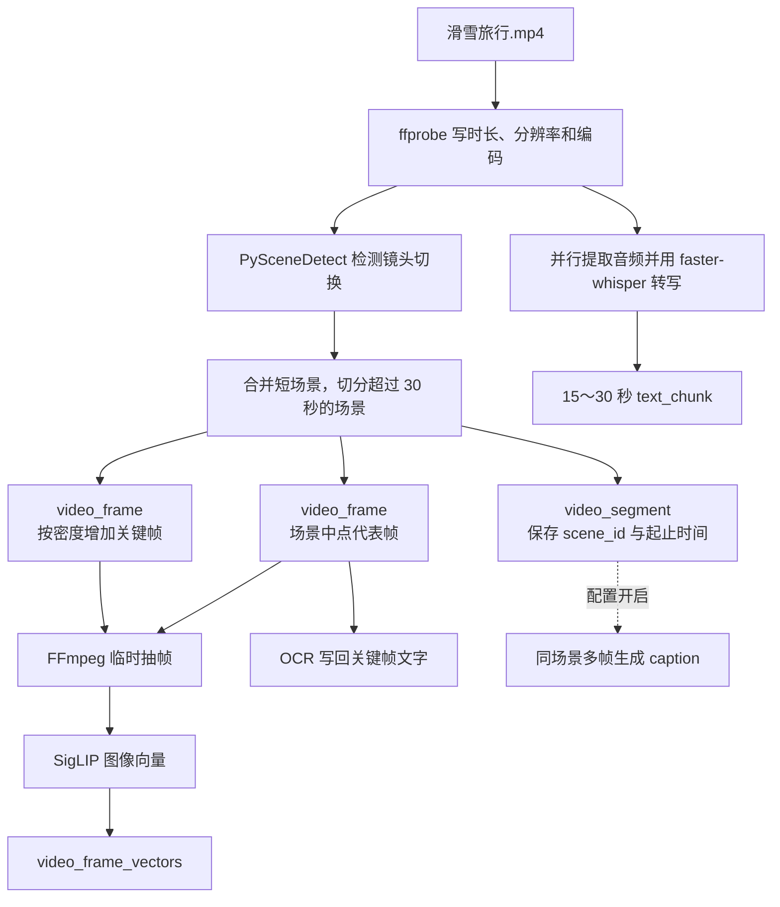

关键点是：场景边界与视觉向量分开。`video_segment` 告诉接口“应播放哪一段”，同场景多个 `video_frame` 告诉检索“这一段可能出现哪些画面”。因此一个场景可以用多帧覆盖内容变化，又只作为一个顶层结果返回。实现见 `IndexMediaHandler._video_asset_inputs()`。

## 三、在线搜索数据生命周期

### 3.1 为什么搜索不能走异步 job

用户等待的是即时结果，因此查询文本必须同步生成 embedding。`SearchQueryVectorService.embedQuery()` 调用 `ModelGatewayService.embedText()`，后者通过 localhost HTTP 调用 Python model service 的 `/embed/text`。model service 根据 collection 要求路由到 SigLIP 文本塔或 caption 文本模型，并返回模型名、版本、维度；NestJS 对这些字段严格校验，不匹配就直接报错，防止在错误的向量空间搜索。

### 3.2 从 query 到接口结果

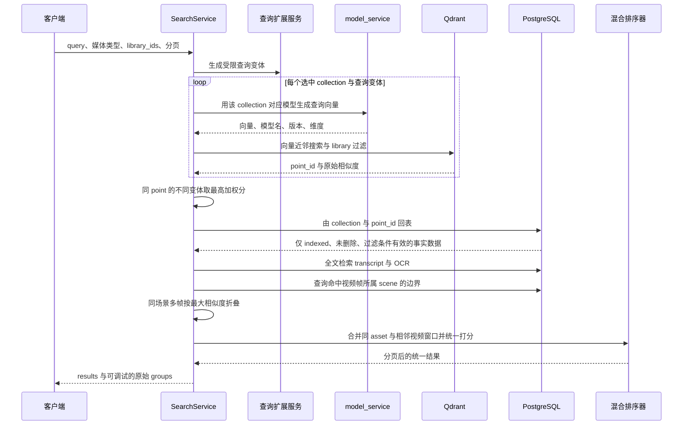

`SearchService.search()` 主要做八件事：

1. 校验 query、过滤条件与分页；
2. 按媒体类型和开关选择 collection；
3. 对查询做有上限的变体扩展；
4. 按 collection 对应模型生成查询向量，且以“模型、版本、维度、query”为键缓存；
5. 从各 collection overfetch 候选，同一 point 在多个变体中取最高加权分；
6. 调用 `hydrateResults()` 回 PostgreSQL 补齐事实；
7. 同时调用 `textSearchGroup()` 从 PostgreSQL 全文索引召回 transcript 与 OCR；
8. 将所有候选转换为统一结构，先做视频场景 MaxSim，再用 `buildHybridResults()` 合并排序。

### 3.3 回表为什么是正确性边界

`listSearchResultMetadata()` 不相信 Qdrant payload 的最终业务状态。它要求：

- collection 与命中来源一致；
- `vector_ref.status = indexed`；
- 文件和媒体库均未软删除；
- media type 与 library 过滤再次满足。

因此可能出现“Qdrant 返回了 30 个 point，最终 group 少于 30 个”的情况。这不是静默吞错，而是索引与事实短暂不一致时的防脏数据设计；原始 group 和搜索耗时日志保留了排查入口。

### 3.4 视频 Scene MaxSim 是什么

同一视频场景有多张关键帧。如果直接返回，每张帧都会占一个结果位，用户会看到重复片段。`collapseVideoFramesByScene()` 按 `(file_id, scene_id)` 分组，取该组相似度最大的帧作为代表，即 MaxSim；再用 PostgreSQL 的 `video_segment` 补回整个场景起止边界，并把所有命中帧放入 `merged_asset_ids`。

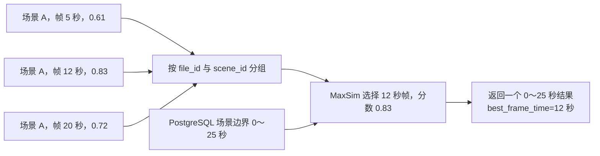

边界缺失、多条活跃 segment 或边界为空都会抛出异常，而不是猜一个范围。源码见 `listVideoSceneBounds()` 与 `collapseVideoFramesByScene()`。

### 3.5 混合排序如何处理不可直接比较的 score

Qdrant 的余弦相似度与 PostgreSQL 的 `ts_rank_cd` 不是同一种分数，不能把原始值直接相加。`buildHybridResults()` 先将文本分数映射为 `raw / (raw + 1)`，向量分数截断到 0～1，再使用向量来源权重 0.55、文本来源权重 0.45 组合；多个语义信号共同命中时加 0.08。弱向量来源低于 0.1 会被过滤，同一来源的重复命中取最大值，避免“帧越多分数越高”。

需要特别区分三种 score：

- group 中的 `cosine_similarity`：某个 collection 内的原始或查询扩展加权相似度；
- text group 中的 `ts_rank_cd`：PostgreSQL 全文排序分；
- 最终 `hybrid_score`：项目自定义的归一化、加权与多信号奖励结果。

它们都只是排序信号，不是“答案正确的概率”。正确与否必须由人工标注的查询—相关结果评测集来验证，而不能仅凭 score 大小判断。

## 四、关键状态与状态转移

### `media_file.index_status`

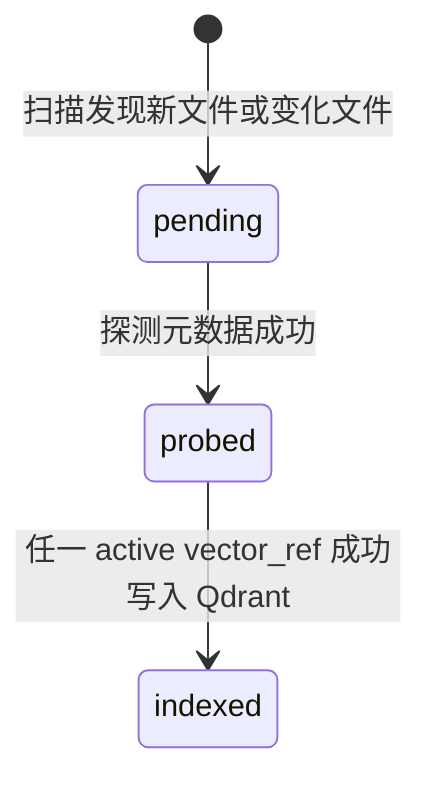

这里的 `indexed` 含义不是“所有 OCR、转写、caption 和向量都完成”，而是“至少已有一个可搜索向量”。`mark_vector_ref_indexed()` 在同一 PostgreSQL 事务中更新 ref 和文件状态，避免 ref 已 indexed 而文件计数仍 pending。

当前源码虽然统计界面会读取 `failed` 文件数，但索引链路没有把 `media_files.index_status` 写成 `failed` 的实现；失败事实目前主要保存在 `jobs.status` 与 `error_message`。面试时应如实描述这个状态模型缺口，不能把理想状态机说成已经实现。

### `vector_ref.status`

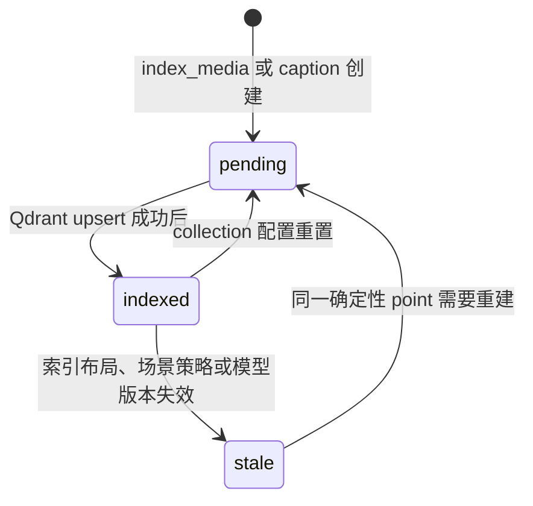

先写 Qdrant，再把 ref 标记 indexed，保证 PostgreSQL 不会声称一个尚未写入的 point 可用。反过来，如果 Qdrant 写成功而 PostgreSQL 提交失败，ref 仍 pending；重试用同一 point id 再次 upsert，不会生成重复点。

### `jobs.status`

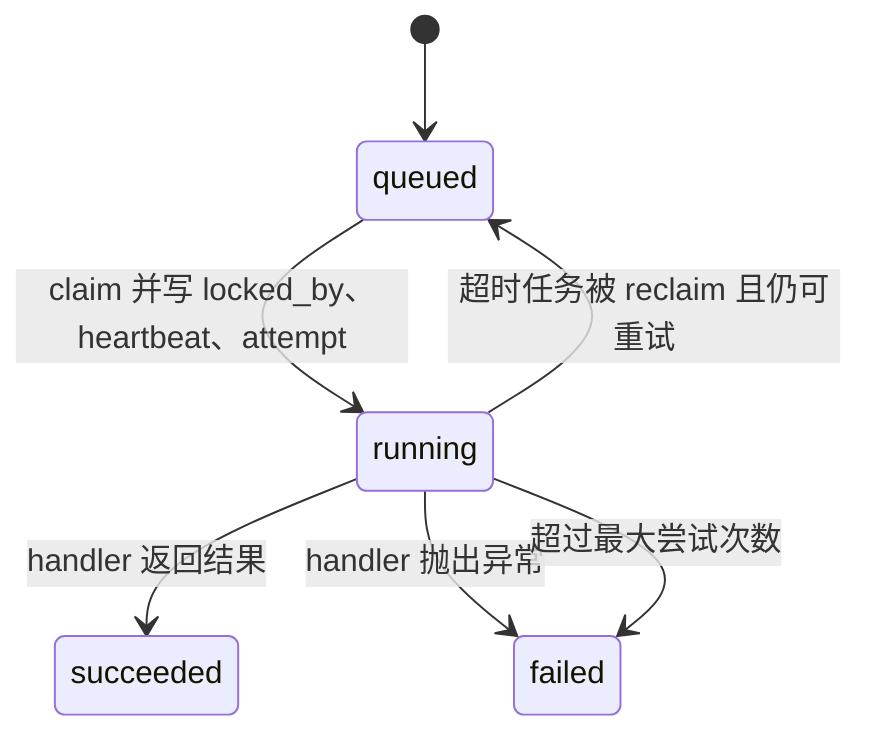

Python `PostgresJobRepository.claim_next_job()` 使用 `FOR UPDATE SKIP LOCKED`，多个 worker 不会同时领取同一 queued job。服务端对应的 `reclaimStaleJobs()` 负责处理失联任务。

## 五、并发、幂等与一致性边界

### 确定性 `point_id`

point id 使用固定 namespace 的 UUIDv5，输入为：

```text
asset_id | collection_name | model_name | model_version | vector_kind | content_hash
```

**为什么包含这些字段**：同一 asset 在不同 collection、模型版本或内容版本下不能误用旧向量；完全相同的索引重试又必须得到同一 id。TypeScript `deterministicPointId()` 与 Python `deterministic_point_id()` 使用相同 namespace 和拼接顺序，保证跨语言一致。

### 三层幂等

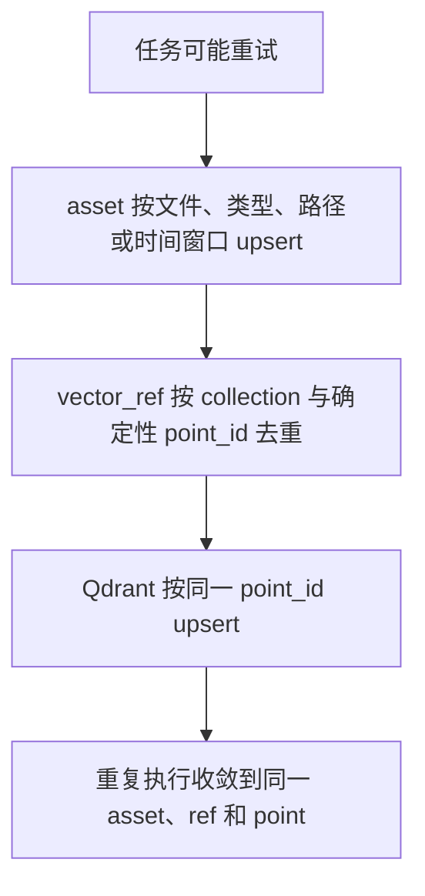

`JobsService.queuePendingEmbeddingJobs()` 还会按 `asset_id + collection + model_name + model_version` 查历史尝试时间；只有 ref 在最近一次尝试之后又被更新，才重新创建任务，防止 coordinator 对失败项无限造新任务。

### 一致性边界

系统没有 PostgreSQL 与 Qdrant 的分布式事务，而是用有顺序的写入和可重试幂等实现最终一致：

1. PostgreSQL 先创建 pending ref；
2. worker 生成向量并 upsert Qdrant；
3. 成功后在一个 PostgreSQL 事务中把 ref 和文件标为 indexed；
4. 搜索只回表接受 indexed ref。

最危险窗口是第 2 步成功、第 3 步失败。此时 Qdrant 有孤立或提前存在的 point，但 PostgreSQL 不返回它；重试会覆盖同 id point并再次提交状态，所以不会制造重复结果。相反，如果先把 ref 标 indexed 再写 Qdrant，就可能产生数据库宣称可搜索、Qdrant 却没有 point 的假状态，当前顺序避免了这一点。

### Fail Fast 与可观察性

关键边界主动校验并抛错：向量维度不符、模型名或版本不符、显式指定但不可用的计算设备、场景边界缺失或重复、caption 无文本等都不会被悄悄兜底。搜索记录查询扩展诊断、各阶段耗时和 scene MaxSim 折叠详情；视频索引记录策略、fallback 原因、场景数与关键帧数。

需要如实指出一个例外：`IndexMediaHandler._video_asset_inputs()` 当前把场景检测设计成 best-effort，检测器异常、场景过多或无可用场景时会记录 `fallback_reason` 并退回固定 30 秒窗口。这是显式、可观察的降级，不是无日志吞错。

## 六、面试时如何用一分钟讲清这条链路

可以这样回答：

> 我的系统把 PostgreSQL 作为媒体事实源，把 Qdrant 作为可重建的向量索引。扫描后先记录原文件，再把图片或视频拆成可定位的 asset；每个待索引 asset 都会建立带模型版本和状态的 vector_ref。Python worker 使用 SigLIP 生成图片或关键帧向量，以确定性 UUIDv5 写入 Qdrant，成功后才把 ref 标成 indexed，因此重试不会产生重复 point。搜索时 NestJS 同步调用本地模型服务，把查询编码到对应 collection 的同一向量空间，再从 Qdrant 召回 point id。所有命中必须回 PostgreSQL 校验软删除和索引状态并补齐路径、时间范围；同时 PostgreSQL 全文检索召回 OCR 和语音转写。视频关键帧按场景做 MaxSim 折叠，最后把视觉、OCR、转写和 caption 信号归一化后混合排序。这样既保留向量检索速度，也让业务事实、一致性和结果定位可控。

## 七、面试官最可能沿数据流追问什么

1. **为什么 PostgreSQL 和 Qdrant 都存 `file_id` 等字段？** 期待回答：payload 为过滤和排查提速，但 PostgreSQL 才是事实源，最终必须回表。
2. **Qdrant score 是准确率吗？** 不是，它只表达当前向量空间和距离函数下的相似程度；跨 collection 也不能直接比较。
3. **为什么查询 embedding 同步、媒体 embedding 异步？** 查询位于请求关键路径；媒体索引耗时且可排队，二者延迟目标不同。
4. **worker 重试会不会产生重复向量？** asset 语义 upsert、确定性 point id、Qdrant upsert 三层共同保证幂等。
5. **PostgreSQL 与 Qdrant 写一半失败怎么办？** 先 Qdrant 后 indexed 状态；中断时 PostgreSQL 不放行结果，重试覆盖同 point。
6. **为什么视频不只取一张缩略图？** 单帧无法覆盖场景内变化；多关键帧提高召回，Scene MaxSim 防止结果重复。
7. **为什么不能直接把余弦分和全文分相加？** 二者尺度不同，必须各自归一化，再按产品策略加权。
8. **`media_file=indexed` 是否意味着全部处理完成？** 不是，只表示第一条活跃向量已经可搜索；OCR、转写和 caption 可独立完成或失败。
9. **模型升级如何避免新查询搜旧向量？** `vector_ref` 和 point id 都包含模型名、版本、维度与内容哈希；collection 配置变化会把 ref 重置为 pending。
10. **如何定位召回差发生在哪一层？** 查看 `groups` 分离后的各来源：若 Qdrant 原始候选没有目标，是 embedding 或召回问题；有目标但回表消失，是状态或事实同步问题；group 有而最终 results 排后，是折叠或混合排序问题。

## 八、源码阅读顺序

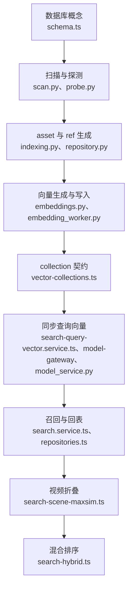

阅读时始终问三个问题：当前数据的身份是什么、当前组件拥有哪类事实、失败后靠什么状态与幂等机制恢复。把这三个问题串起来，就能从“会说技术名词”进入“能解释系统为什么这样设计”。
