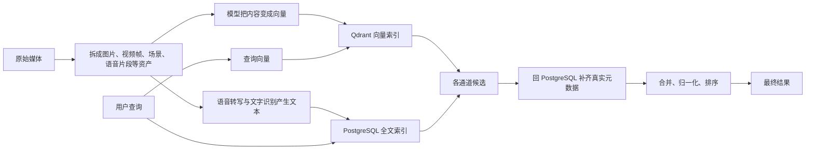
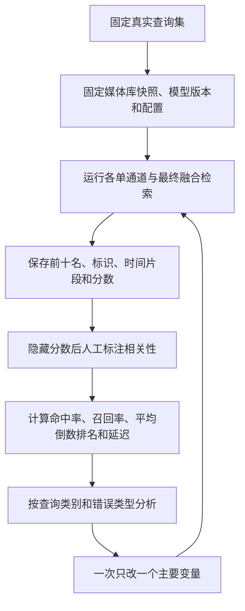

# 索引、检索与面试学习路径

## 这份路线解决什么问题

这份路线不是要求先学完机器学习再讲项目，而是帮助项目作者形成一条能够反复验证的解释链：**媒体为什么能被搜到，搜索结果为什么这样排序，怎样证明一次优化真的有效**。

先记住一句总纲：这个项目把图片和视频画面转换成可比较的数字向量，把语音和画面文字转换成可搜索文本，再由 Qdrant 与 PostgreSQL 分别找候选，最后合并排序。源码入口是 `apps/server/src/search/search.service.ts` 的 `SearchService.search()`；离线向量写入入口是 `apps/worker-py/media_agent_worker/embedding_worker.py` 的各类处理器。

证据：`apps/server/src/search/search.service.ts` 同时执行多组 Qdrant 搜索与 PostgreSQL 全文搜索；`hydrateResults()` 再按 point id 回 PostgreSQL；`apps/server/src/search/search-hybrid.ts` 的 `buildHybridResults()` 负责合并和排序。

---

## 第一层：先掌握最少必要概念

### 1. 索引不是“搜索”，而是提前准备可搜索的表示

索引阶段发生在用户搜索之前。它读取媒体、拆分资产、提取内容，并把结果写入适合查询的数据结构。没有索引，搜索时就只能临时逐个打开约 1 TB 文件，无法满足交互延迟。

本项目至少有两类索引：

| 索引 | 它保存什么 | 擅长回答什么 | 项目证据 |
| --- | --- | --- | --- |
| 向量索引 | 图片、视频帧或描述文本的数字向量 | “内容含义或画面是否相似” | `apps/server/src/qdrant/vector-collections.ts`、`apps/worker-py/media_agent_worker/embedding_worker.py` |
| 全文索引 | 语音转写、图片或视频帧识别出的文字 | “是否出现这些具体词” | `apps/server/src/database/schema.ts` 的 `text_tsv`，`apps/server/src/database/repositories.ts` 的文本搜索查询 |

面试表达：**索引是离线重计算，检索是在线低延迟读取；因此媒体向量化走异步 worker，而查询向量必须同步生成。** 后半句可由 `SearchQueryVectorService.embedQuery()` 的注释和 `ModelGatewayService.embedText()` 的同步 HTTP 调用证明。

### 2. 向量与嵌入是什么

向量可以先理解为一串数字坐标；嵌入是“模型把内容转换成这串坐标”的过程。相似内容在坐标空间中通常更接近。维度不是内容类别数，而是模型学习出的表示空间大小。

项目中的 SigLIP 图片和文本向量是 768 维，Caption 文本向量是 384 维；配置证据在 `apps/server/src/qdrant/vector-collections.ts`。这些向量不能随意混搜：只有使用兼容模型、版本和维度生成的向量才处在同一个可比较空间。`ModelGatewayService.embedText()` 会校验模型名、版本和维度，`SiglipEmbedder._finalize()` 也会在维度不一致时直接失败。

### 3. Transformer、SigLIP 与 `transformers` 的关系

- **Transformer** 是一类神经网络架构，不是本项目中的某一个服务。
- **SigLIP** 是一个基于这类架构训练的视觉—文本模型。它有图像编码能力和文本编码能力，训练目标让匹配的图片与文字靠近，因此能实现“用文字搜画面”。
- **`transformers`** 是加载和运行预训练模型的 Python 软件库。本项目通过 `AutoProcessor`、`AutoModel`、`AutoTokenizer` 使用它，并不是“调用一个叫 Transformer 的数据库”。

源码验证顺序：先看 `apps/worker-py/media_agent_worker/embeddings.py` 中 `SiglipEmbedder.embed_image_path()` 与 `embed_text()`；两者最终都经过 `_finalize()` 归一化为向量。再看 `TransformerTextEmbedder`，理解 Caption 文本使用的是另一套文本模型。

### 4. Qdrant 是什么，为什么还需要 PostgreSQL

Qdrant 是向量检索引擎：输入一个查询向量，它从大量已存向量中返回最相近的 point id 和相似度分数。它解决“高维向量怎样快速找近邻”，不负责成为项目的业务事实数据库。

PostgreSQL 保存文件、资产、时间范围、删除状态、任务状态及 `vector_refs`。Qdrant 只保存向量与轻量 payload。搜索命中 Qdrant 后，`SearchService.hydrateResults()` 调用 `listSearchResultMetadata()` 回表，并保持 Qdrant 的顺序；`apps/server/src/database/repositories.ts` 还会用数据库状态过滤软删除或失效记录。

面试时可把设计取舍说成：**Qdrant 是可重建的召回索引，PostgreSQL 是事实源；这样避免 payload 不同步后直接把脏数据返回给用户。**

### 5. “纯视觉向量”不是纯图片查询

这里的“视觉向量通道”是：媒体侧把图片或视频帧送进 SigLIP 图像编码器；查询侧把自然语言送进同一模型的文本编码器；两者在共享空间比较。它仍然是“文字搜图片”，只是被检索对象的表示来自画面，而不是 OCR、转写或 Caption 文本。

四类信号应这样区分：

| 信号 | 内容从哪里来 | 最适合的查询 | 容易漏掉什么 |
| --- | --- | --- | --- |
| 视觉向量 | 原图或视频帧经 SigLIP | “夕阳下奔跑的人”“蓝色汽车” | 精确字幕、说话内容、抽象事件细节 |
| 文字识别 | PaddleOCR 识别画面文字 | “发票编号”“路牌上的某个词” | 没写在画面上的语义 |
| 语音转写 | faster-whisper 转成文本 | “视频里说过某句话” | 无对白的画面内容 |
| Caption | 视觉语言模型生成场景描述，再嵌入文本 | “有人在厨房准备晚餐”等组合语义 | 描述模型没提到的细节，且可能产生错误描述 |

项目当前 `SearchService` 的视觉集合包括 `image_vectors`、`video_frame_vectors` 和可开关的 `video_segment_vectors`；全文搜索覆盖转写与文字识别；Caption 集合由 `captionSearchEnabled` 控制。最终原因映射见 `vectorReason()` 与 `textSearchReason()`。

### 6. 召回、排序与重排

- **召回**：从整个库里尽量取出可能相关的候选，重点是别漏。
- **排序**：把候选按某个分数排列。
- **重排或融合排序**：汇合不同来源的候选，统一尺度后重新排列。

本项目每个通道会多取候选，再合并分页。`SearchService.sourceLimit()` 至少取 30 条、通常取请求范围的三倍、最高 300 条，原因是相同资产或视频帧折叠后候选会变少。`buildHybridResults()` 对不同来源做归一化和加权，不能直接把余弦相似度与 PostgreSQL 的 `ts_rank_cd` 裸分数相加。

### 7. Score 为什么不是准确率

Qdrant 的余弦分数回答的是“两个向量在当前模型空间里有多接近”，不是“这个结果有多少概率正确”。它受到模型、内容、查询措辞、集合和向量归一化方式影响；不同检索来源的原始分数也不在同一尺度。

因此以下判断都不可靠：

- 分数 0.8 就代表 80% 正确；
- 一个查询最高 0.7 比另一个查询最高 0.6 更准确；
- 余弦 0.5 一定比全文分数 0.4 更相关。

本项目已经体现这个边界：`scoreKindForDistance()` 把原始向量分数标为 `cosine_similarity`，全文组标为 `ts_rank_cd`；`search-hybrid.ts` 先按来源归一化和加权，再生成独立的 `hybrid_score`。即使 `hybrid_score` 在 0 到 1，也仍是排序公式输出，不是概率。准确与否最终需要人对“查询—结果”相关性做标注。

---

## 第二层：评测指标用一个例子串起来

假设查询是“海边日落”，人工确认媒体库里共有 2 个相关片段。系统前 3 名结果为：

1. 海边日落，强相关；
2. 城市夜景，不相关；
3. 普通海滩白天，弱相关。

为了先讲二元指标，把“强相关、弱相关”都算相关，则前 3 名找到了 2 个相关结果。

| 指标 | 白话问题 | 本例结果 | 适合观察什么 |
| --- | --- | --- | --- |
| Top-K 命中率 | 前 K 名里有没有至少一个相关结果？ | 命中，为 1 | 用户能否很快看到至少一个可用素材 |
| 精确率@K（Precision@K） | 前 K 名有多少比例是相关的？ | 2/3 | 结果列表里噪声多不多 |
| 召回率@K（Recall@K） | 所有已知相关素材里，前 K 名找回多少？ | 2/2 = 1 | 是否漏掉可用素材 |
| 平均倒数排名（MRR）的单查询值 | 第一个相关结果排第几？取其名次倒数 | 第 1 名，值为 1 | 最先出现的可用结果够不够靠前 |
| 归一化折损累计增益@K（NDCG@K） | 强相关是否比弱相关排得更靠前？ | 需使用分级标注计算 | 整体顺序是否符合相关程度 |

“Top-K 命中率”通常要在多条查询上统计。例如 10 条查询中有 8 条在前 5 名至少出现一个相关结果，则 Top-5 命中率是 8/10。它不关心一条查询命中了 1 个还是 10 个。

平均倒数排名是在多条查询上，对每条查询“第一个相关结果名次的倒数”求平均。例如三条查询的首个相关结果分别在第 1、2、4 名，则平均倒数排名为 `(1 + 1/2 + 1/4) / 3`。它重视首个可用结果，后面的相关结果不再参与。

归一化折损累计增益需要把相关性标成等级，例如 0 为不相关、1 为勉强相关、2 为相关、3 为非常相关；越靠前的结果权重越高，再除以理想排序的得分。极简理解：如果系统顺序的等级是 `[3, 0, 2]`，理想顺序是 `[3, 2, 0]`，前者因为把等级 2 的结果放到了第 3 名，所以 NDCG 小于 1；如果正好按 `[3, 2, 0]` 排列，NDCG 就是 1。它适合判断“强相关是否被排在弱相关之前”，但标注成本高于二元指标。

### 本项目个人素材场景的优先级

建议第一阶段只采用：

1. **Top-5 命中率**：最容易建立，直接回答“前一屏有没有可用素材”。
2. **召回率@10**：适合剪辑场景，因为用户可能想找出多个可用片段，而不只是第一个。
3. **平均倒数排名**：判断首个可用素材是否足够靠前。
4. **查询延迟的中位数与较慢分位数**：质量提高不能以搜索不可用为代价；`SearchService` 已记录扩展、向量、全文、混合和总耗时。

精确率@K 可作为噪声指标同时记录。等二元标注稳定、确实需要比较细粒度排序方案后，再加入归一化折损累计增益。不要为了面试把所有指标都堆上去。

一个重要限制是“共有多少相关素材”很难穷举，因此召回率@K 的分母必须写成“评测集中已标注的相关素材数”，不能声称代表全库绝对召回率。

---

## 第三层：不虚构数据的最小人工评测集

### 建立方式

先选 20 条真实查询；如果时间很少，先做 10 条也可以。查询不能只挑系统擅长的，应覆盖：

- 具体物体与场景；
- 人物动作和组合语义；
- 画面中的精确文字；
- 视频或音频中说过的话；
- Caption 可能帮助的抽象场景；
- 中文、英文或中英混合的真实用法；
- 预期没有结果的负例。

每条查询从真实使用需求产生，不为模型改写。分别保存每个通道的前 10 名和最终融合前 10 名，然后人工看素材或对应时间片段，做盲标注。先隐藏分数，避免被 score 暗示。

### 推荐表格字段

| 字段 | 含义 |
| --- | --- |
| `评测版本` | 本次代码、模型和配置的可追溯标识 |
| `查询编号`、`查询文本` | 稳定标识与原始输入 |
| `查询类别` | 物体、动作、文字、对白、抽象场景、负例等 |
| `来源通道` | 视觉、文字识别、转写、Caption、最终融合 |
| `排名` | 在该通道或最终列表的位置 |
| `文件编号`、`资产编号` | 对应 `file_id`、`asset_id` |
| `起止时间` | 视频或音频片段定位 |
| `相关等级` | 0 不相关、1 勉强可用、2 相关、3 非常相关 |
| `相关理由` | 一句人工判断依据 |
| `错误类型` | 漏召回、错误文字、错误描述、场景边界、排序靠后等 |
| `原始分数类型与分数` | 余弦、全文排名或混合分数，仅用于诊断 |
| `查询总耗时` | 质量与性能共同观察 |

### 执行方式

比较优化前后时必须固定查询集、媒体库快照和标注规则，并记录模型名、模型版本、向量维度、Caption 开关、视频片段开关、查询扩展配置与代码提交。项目已在 `vector-collections.ts` 集中记录模型契约，搜索响应的 `groups` 又保留原始来源，适合做逐通道诊断。

不要只比较总平均值。还要按查询类别查看：如果视觉查询变好，但精确文字查询变差，总平均可能掩盖回归。也不要边看结果边改“正确答案”；有争议的样本应保留备注并重新审核。

---

## 第四层：源码阅读顺序

### 快速理解：先读这八处

1. `apps/server/src/qdrant/vector-collections.ts` — 看 collection、模型、维度和距离如何绑定；读完能解释为什么不同向量不能混用。
2. `apps/server/src/database/schema.ts` — 找 `media_files`、`media_assets`、`vector_refs`；读完能解释文件、可检索资产和 Qdrant point 的关系。
3. `apps/worker-py/media_agent_worker/indexing.py` — 看索引如何生成资产与稳定 point id；读完能解释索引准备阶段。
4. `apps/worker-py/media_agent_worker/embedding_worker.py` — 看 `_embed_and_write()`、`_write_vector()`；读完能解释媒体怎样变成 Qdrant point。
5. `apps/worker-py/media_agent_worker/embeddings.py` — 看 SigLIP 的图像、文本编码和归一化；读完能解释模型实际负责什么。
6. `apps/server/src/search/search-query-vector.service.ts` 与 `model-gateway/model-gateway.service.ts` — 读完能解释为什么查询向量同步生成，以及契约如何防止错模型和错维度。
7. `apps/server/src/search/search.service.ts` — 按 `search()`、`searchCollection()`、`hydrateResults()`、`textSearchGroup()`、`toHybridCandidates()` 顺序读；读完能串起在线检索。
8. `apps/server/src/search/search-hybrid.ts` 与 `search-scene-maxsim.ts` — 读完能解释多来源分数、候选合并和视频场景折叠。

### 分阶段学习成果

| 阶段 | 补充概念 | 阅读源码 | 学完必须能回答 |
| --- | --- | --- | --- |
| 一：数据模型 | 文件、资产、派生状态、事实源 | `schema.ts`、`repositories.ts` | 为什么一个视频会对应多个资产和 point？为什么要有 `vector_refs`？ |
| 二：向量表示 | 嵌入、维度、归一化、余弦相似度 | `vector-collections.ts`、`embeddings.py` | SigLIP、Transformer、`transformers`、768 维分别是什么？ |
| 三：离线索引 | 异步任务、幂等写入、模型契约 | `indexing.py`、`embedding_worker.py`、`qdrant.py` | 一个文件怎样进入 Qdrant？失败重试为何不会无限产生新 point？ |
| 四：在线召回 | 查询向量、近邻搜索、回表 | `search-query-vector.service.ts`、`model-gateway.service.ts`、`search.service.ts` | 为什么查询不能走 worker？为什么 Qdrant 命中后还要查 PostgreSQL？ |
| 五：多通道检索 | 视觉、文字识别、转写、Caption | `search.service.ts`、转写、文字识别与 Caption 处理器 | 每条通道解决什么查询，失败模式是什么？ |
| 六：融合排序 | 归一化、权重、合并、场景最大相似度 | `search-hybrid.ts`、`search-scene-maxsim.ts` | 为什么不同 raw score 不能直接比较？同一视频的多帧怎样避免霸榜？ |
| 七：评测诊断 | 人工相关性、Top-K 指标、错误分类 | 自建评测表与 `groups` 输出 | 如何证明优化有效？如何定位问题在索引、召回还是排序？ |

第一轮可以跳过 Next.js 页面细节、Agent 工具调用、剪辑执行、数据库迁移历史和生成的 JSON Schema；它们不影响先理解检索主链。需要解释用户体验、协议一致性或历史兼容时再回来读。

---

## 第五层：面试问题树与回答要点

以下“回答要点”是组织真实经历的框架，不是可以直接冒充的项目数据。凡是吞吐量、延迟、命中率、媒体数量和优化幅度，都只能填写实际测量结果；没有数据就明确说“当前尚未建立正式基准，这是我下一步补齐的验证”。

### 一、整体架构

**问题：请介绍系统如何从本地文件走到搜索结果。**

回答要点：产品问题与本地隐私约束；NestJS 负责协议和编排，Python worker 负责耗时媒体与模型任务；PostgreSQL 是事实源与任务队列，Qdrant 是向量召回索引；查询阶段同步生成 query embedding，并行查多条通道，回表后融合排序。

**追问：为什么是多进程和跨语言，而不是全部写在 Node.js 或 Python？**

回答要点：模型、媒体处理生态集中在 Python；业务 API、共享 schema 与前端采用 TypeScript；耗时批处理与低延迟在线查询需要隔离。承认代价是部署拓扑和协议一致性更复杂，项目用共享 schema、模型注册表和运行日志降低风险。

### 二、索引

**问题：索引一个视频发生了什么？**

回答要点：扫描和探测文件；生成场景、视频帧、音频文本等派生资产；创建 pending `vector_refs`；worker 读取当前 ref、提帧或读取图片、生成向量、校验维度、幂等 upsert Qdrant，成功后才标 indexed。依据是 `indexing.py`、`embedding_worker.py` 与 repository 的状态更新。

**追问：如何保证重试幂等和跨语言一致？**

回答要点：point id 由稳定输入生成 UUIDv5；worker 执行时重新读取 ref；Qdrant 使用同 point id upsert；模型名、版本、维度属于契约。不要只说“队列会重试”。

### 三、模型

**问题：为什么 SigLIP 能用文字搜图片？**

回答要点：图片编码器和文本编码器把两种输入映射到共享表示空间；训练使匹配图文靠近；查询文本向量与媒体图像向量比较余弦相似度。指出这不是 OCR，也不保证理解所有细粒度事件。

**追问：Transformer 与 SigLIP 是什么关系？为什么 Caption 又用另一个模型？**

回答要点：Transformer 是架构族，SigLIP 是具体视觉—文本模型，`transformers` 是加载模型的软件库；Caption 先由视觉语言模型生成文字，再由专门文本嵌入模型编码，因此 collection 的模型与维度不同。

### 四、向量库

**问题：为什么选择 Qdrant？它保存哪些内容？**

回答要点：需要本地高维近邻检索、collection 与过滤能力；point 保存向量和轻量 payload。避免泛泛比较未实际验证过的数据库性能。

**追问：为什么不把所有元数据都放 Qdrant？**

回答要点：业务事实、软删除、任务状态和关系查询仍由 PostgreSQL 管理；Qdrant 可重建且可能 payload 漂移；命中后回表保证用户可见数据以事实源为准。

### 五、混合检索

**问题：为什么有向量检索还需要文字识别、转写和 Caption？**

回答要点：不同信号覆盖互补意图；视觉模型擅长画面概念，全文检索擅长精确词语，Caption 帮助组合和叙事语义，但可能描述错误。说明最终结果保留 `source_scores`、`reasons` 和 `primary_reason` 以便解释。

**追问：不同通道的分数如何融合？**

回答要点：原始余弦与全文排名尺度不同，不能裸加；当前 `scoreCandidate()` 按来源归一化、加权，对多信号给奖励，再截断到 0—1；同来源合并取最大值以避免窗口数量扭曲。明确 `hybrid_score` 不是正确概率。

**追问：视频很多帧会不会霸榜？**

回答要点：按文件和场景折叠帧候选，使用同场景最强帧作为视觉证据并从 PostgreSQL取得场景边界；源码为 `collapseVideoFramesByScene()` 和 `listVideoSceneBounds()`。

### 六、评测

**问题：你怎么知道搜索变准了？**

当前诚实回答：开发阶段主要看真实查询与 score，能发现问题但不足以证明整体改进，因为 score 只是模型相似度或排序分数。现在应补充固定人工评测集，记录 Top-5 命中率、已标注集合上的召回率@10、平均倒数排名、按查询类别的错误分布和延迟，并对比单通道与融合结果。

**追问：为什么不用 score 判断准确率？**

回答要点：score 不是真实相关性标签，不同查询和来源尺度也不同；必须让人标注查询—结果是否可用，再用排序指标聚合。

**追问：召回率的分母从哪里来？**

回答要点：来自固定评测集里人工确认的相关素材集合；如果没有穷举全库，只能称“已标注集合上的召回率”，不能夸大为全库真实召回。

### 七、故障排查

**问题：搜索结果完全不相关，你怎样定位？**

回答顺序：

1. 固定一条可复现查询与预期素材，确认文件和资产状态；
2. 检查目标资产是否生成、`vector_refs` 是否 indexed、模型版本与维度是否一致；
3. 单独查看每个 `groups` 的候选，判断是所有通道都没召回，还是融合排序把正确候选压下去；
4. 对视觉通道检查媒体向量与查询向量是否来自兼容模型，并观察原始候选；
5. 对文字通道检查转写、文字识别或 Caption 的实际文本是否正确；
6. 正确结果已在候选池但最终靠后，才检查归一化、权重、合并与场景折叠；
7. 将根因归类为资产生成、索引写入、模型表示、召回、回表过滤或排序，并补日志或测试。

项目已有 `search_timing`、查询扩展诊断和 `scene_maxsim` 日志，位置在 `SearchService.search()`、`searchCollection()` 与 `toHybridCandidates()`；这些日志不能替代评测，但能定位链路阶段。

### 八、扩展性

**问题：约 1 TB 素材下，系统如何扩展？**

回答要点：批处理异步化，PostgreSQL 用任务状态协调，worker 可通过 `FOR UPDATE SKIP LOCKED` 竞争任务；大向量不经过 TS—Python job 参数，worker 直接写 Qdrant；查询按来源 overfetch 后在内存合并且设 300 上限。诚实说明尚未压测的部分，特别是深分页、模型吞吐、长任务租约和多 worker 资源竞争。

**追问：模型升级怎么办？**

回答要点：模型名、版本、维度、向量类型与 collection 注册表绑定；旧向量不能假装兼容，应创建或重建索引并让 refs 回到待处理状态。`apps/server/src/database/repositories.ts` 对 collection 配置变化已有重置逻辑。

---

## 最终自测：能讲清这些才算真正理解

不看文档，用自己的话完成以下练习：

1. 用一分钟解释“索引”和“检索”的区别。
2. 画出一张图，说明“文字搜视频画面”时查询与视频帧分别怎样进入 SigLIP。
3. 解释为什么 Qdrant score 不是准确率，以及为什么不能和 `ts_rank_cd` 直接比较。
4. 从 `SearchService.search()` 口述到 `buildHybridResults()`，并指出 PostgreSQL 回表的位置。
5. 给一个视觉向量失败、文字识别成功的查询例子，再给一个相反例子。
6. 用三条结果手算 Top-K 命中、精确率、召回率和首个相关结果倒数排名。
7. 面对“不相关结果”，按索引、召回、排序三层给出可验证的排查步骤。
8. 不虚构任何数字，说明当前评测不足与下一步如何建立基线。

完成这八项后，你的项目介绍就不再是技术名词列表，而会形成一条完整论证：**真实素材查找问题 → 离线多模态索引 → 在线多通道召回 → 事实源回表 → 可解释融合排序 → 人工评测验证 → 日志定位失败阶段**。
