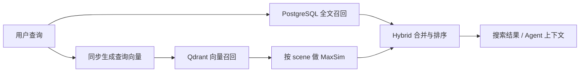

# RAG在当前项目中的应用

> [!abstract] 我们的结论
> 我们的项目已经使用 RAG。它不是“把整部视频塞给大模型”，而是先把本地媒体加工成可检索证据，搜索时召回图片、视频帧、字幕、OCR 和场景 caption，再把候选交给用户或 Agent。这里的“我们的项目”指我们两个人协作做出来的项目。

## 一条查询怎样经过 RAG



- 视觉语义：SigLIP 查询 `image_vectors` 和 `video_frame_vectors`。
- 可见文字：OCR 写入 `media_assets.text_content`，由 PostgreSQL FTS 召回。
- 语音内容：转写切块后由 PostgreSQL FTS 召回。
- 场景语义：Qwen2.5-VL 读取同一场景的多张关键帧，生成 `scene-caption-v2`，caption 再向量化到 `caption_text_vectors`。
- 最终结果使用 `hybrid_score`，因为它融合了多个不同量纲的来源；单个 Qdrant group 内才是 cosine similarity。

## 视频怎样切割和向量化

1. PySceneDetect 先按镜头变化识别原始 scene。
2. 无明显镜头变化的长 scene 仍会按最多 30 秒拆成检索窗口。因此三分钟固定机位唱歌视频，即使镜头不切，也会形成约 6 个窗口，而不是只用整段的 6 张图片。
3. 每个窗口至少创建一个中点 `video_frame`；根据 `KEYFRAME_DENSITY` 还会创建更多关键帧。
4. 每张关键帧分别生成 SigLIP 视觉向量，写入 `video_frame_vectors`。我们不做平均池化，也不使用中点单帧生成的 `video_segment_vectors` 代表整段。
5. `video_segment` 仍保留，它是 scene 边界、caption 任务入口和剪辑定位容器，不再是可靠的视觉向量证据。

> [!important] 为什么不是“一个 scene 最多 6 张”
> `SCENE_CAPTION_MAX_FRAMES=6` 只限制一次发给 VLM 生成 caption 的图片数量。长 scene 已先按 `SCENE_MAX_SECONDS=30` 拆窗；视觉检索则使用每张已索引关键帧的独立向量，不受 caption 的 6 张上限约束。

## MaxSim 是什么

同一个 scene 有多张关键帧时，每张帧都与查询计算 cosine similarity。MaxSim 取其中最大值：

$$
score(scene, query)=\max_{frame \in scene} similarity(frame, query)
$$

例如一个场景三帧得分为 `0.82 / 0.91 / 0.76`，场景分数就是 `0.91`，最佳帧作为封面证据，但返回时间范围使用 PostgreSQL 中真实的 scene 边界。这样不会用平均值稀释短暂但重要的画面，也不会把中点帧误认为整个场景。

## 多关键帧 caption

Qwen2.5-VL 支持多图输入。我们的 `scene-caption-v2` 按时间顺序发送同一窗口的 1～6 张关键帧，要求模型综合描述主体、环境、可见文字和明确展示的动作变化，并禁止推断采样帧之间没有展示的事件。

caption metadata 会记录 `scene_id`、模型及 prompt 版本、实际 `source_asset_ids` 和 `frame_times_seconds`。临时帧在成功或失败后都会清理。

## 当前 rerank 与 hybrid score

当前“rerank”是确定性的 hybrid 合并排序，不是异步再调用 VLM：

- 同一 scene 的视觉帧先做 MaxSim。
- 同一候选的视觉、caption、OCR、字幕来源被合并。
- 各来源先做来源内归一化/权重处理，再得到 `hybrid_score` 和命中原因。
- 原始 `groups` 保留各来源分数用于调试，顶部 `results` 才是统一排序。

异步 VLM rerank 暂不实现，因为它会显著增加搜索延迟和运行复杂度；多帧 VLM 当前用于离线 caption 索引。

## 扫描是否会自动完成多帧 caption

新视频执行 `扫描 → probe_media → index_media` 后，会自动切窗、抽关键帧并创建帧向量任务。只有同时满足下面两个开关，才会自动创建 `scene-caption-v2` 任务：

```dotenv
CAPTION_INDEXING_ENABLED=true
LOCAL_VLM_ENABLED=true
```

同时需要 worker、model service、VLM service、Ollama、PostgreSQL、Qdrant、server 和 web 正常运行。已有数据不会仅因升级代码自动变化，需要调用视频批量重建接口，见 [[#现有数据升级步骤]]。

## 现有数据升级步骤

1. 保持 `VIDEO_SEGMENT_SEARCH_ENABLED=true`，先启动完整运行环境。
2. 调用 `POST /jobs/video/reindex`，先用 `{"dry_run":true}` 查看范围，再去掉 dry-run 分批创建 `index_media` 任务。
3. 等 worker 处理完索引、embedding 和 caption 任务。
4. 调用 `GET /jobs/video/reindex-readiness`。必须满足：无缺帧窗口、无超过 30 秒窗口、active `video_segment_vectors` refs 为 0。
5. 单独核对 `segments_without_scene_caption_v2=0`；它不阻断视觉 MaxSim，但代表 caption 数据仍未完整。
6. 固定查询集对比通过后，把 `VIDEO_SEGMENT_SEARCH_ENABLED=false` 并重启 server，正式停止旧 segment 向量在线召回。

> [!warning] 失败必须可见
> readiness 不通过时不要关闭兼容开关，也不要删除旧 Qdrant points。修复失败任务后重新检查；旧 refs 标记 stale，保留审计能力。

## 相关文档

- [[architecture|系统架构]]
- [[vector-index-design|向量索引设计]]
- [[job-protocol|任务协议]]
- [[superpowers/plans/2026-07-10-scene-maxsim-multiframe-caption|实施计划]]
